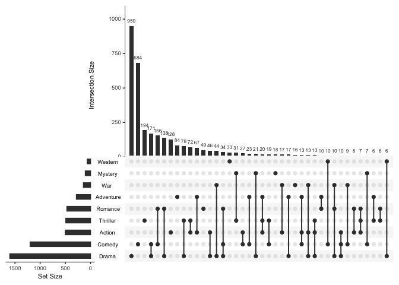

    library(UpSetR)
    library(tidyverse)

    ## ── Attaching packages ─────────────────────────────────────── tidyverse 1.3.2 ──
    ## ✔ ggplot2 3.4.1     ✔ purrr   1.0.1
    ## ✔ tibble  3.1.8     ✔ dplyr   1.1.0
    ## ✔ tidyr   1.3.0     ✔ stringr 1.5.0
    ## ✔ readr   2.1.4     ✔ forcats 1.0.0
    ## ── Conflicts ────────────────────────────────────────── tidyverse_conflicts() ──
    ## ✖ dplyr::filter() masks stats::filter()
    ## ✖ dplyr::lag()    masks stats::lag()

    test2 <- read_csv("../output/upset-test.csv")

    ## Rows: 34947 Columns: 4
    ## ── Column specification ────────────────────────────────────────────────────────
    ## Delimiter: ","
    ## chr (1): gene_id
    ## dbl (3): h, l, g
    ## 
    ## ℹ Use `spec()` to retrieve the full column specification for this data.
    ## ℹ Specify the column types or set `show_col_types = FALSE` to quiet this message.

    head(test2)

    ## # A tibble: 6 × 4
    ##   gene_id             h     l     g
    ##   <chr>           <dbl> <dbl> <dbl>
    ## 1 PGEN_.00g000010     0     1     0
    ## 2 PGEN_.00g000020     0     1     0
    ## 3 PGEN_.00g000030     0     1     0
    ## 4 PGEN_.00g000040     1     1     0
    ## 5 PGEN_.00g000050     1     1     1
    ## 6 PGEN_.00g000060     0     1     0

## sample data

    movies <- read.csv( system.file("extdata", "movies.csv", package = "UpSetR"), header=T, sep=";" )

    head(movies)

    ##                                 Name ReleaseDate Action Adventure Children
    ## 1                   Toy Story (1995)        1995      0         0        1
    ## 2                     Jumanji (1995)        1995      0         1        1
    ## 3            Grumpier Old Men (1995)        1995      0         0        0
    ## 4           Waiting to Exhale (1995)        1995      0         0        0
    ## 5 Father of the Bride Part II (1995)        1995      0         0        0
    ## 6                        Heat (1995)        1995      1         0        0
    ##   Comedy Crime Documentary Drama Fantasy Noir Horror Musical Mystery Romance
    ## 1      1     0           0     0       0    0      0       0       0       0
    ## 2      0     0           0     0       1    0      0       0       0       0
    ## 3      1     0           0     0       0    0      0       0       0       1
    ## 4      1     0           0     1       0    0      0       0       0       0
    ## 5      1     0           0     0       0    0      0       0       0       0
    ## 6      0     1           0     0       0    0      0       0       0       0
    ##   SciFi Thriller War Western AvgRating Watches
    ## 1     0        0   0       0      4.15    2077
    ## 2     0        0   0       0      3.20     701
    ## 3     0        0   0       0      3.02     478
    ## 4     0        0   0       0      2.73     170
    ## 5     0        0   0       0      3.01     296
    ## 6     0        1   0       0      3.88     940

    upset(movies, sets = c("Action", "Adventure", "Comedy", "Drama", "Mystery", 
        "Thriller", "Romance", "War", "Western"), mb.ratio = c(0.55, 0.45), order.by = "freq")

## my data

    upset(test2, sets = c("h", "l", "g"), mb.ratio = c(0.55, 0.45), order.by = "freq")

error

    Error in start_col:end_col : argument of length 0
    7.
    `[.tbl_df`(data, , start_col:end_col)
    6.
    NextMethod(`[`)
    5.
    `[.spec_tbl_df`(data, , start_col:end_col)
    4.
    data[, start_col:end_col]
    3.
    as.data.frame(data[, start_col:end_col])
    2.
    Remove(data, first.col, last.col, Set_names)
    1.
    upset(test2, sets = c("h", "l", "g"), mb.ratio = c(0.55, 0.45),
    order.by = "freq")
