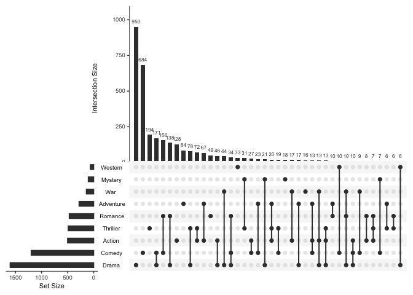
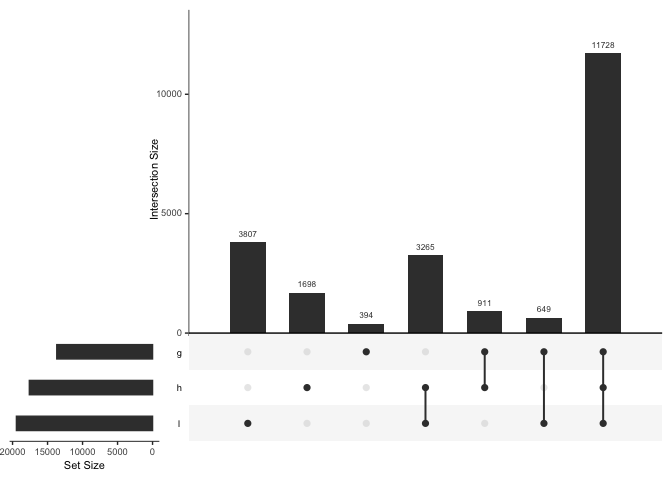
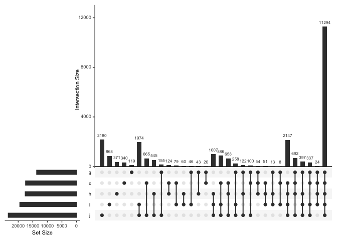
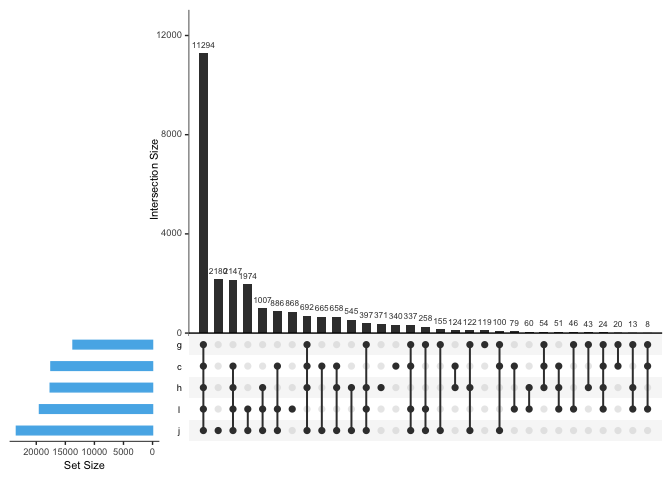
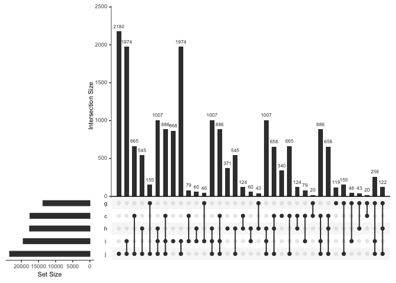

    library(UpSetR)
    library(tidyverse)

    ## ── Attaching packages ─────────────────────────────────────── tidyverse 1.3.2 ──
    ## ✔ ggplot2 3.4.1     ✔ purrr   1.0.1
    ## ✔ tibble  3.1.8     ✔ dplyr   1.1.0
    ## ✔ tidyr   1.3.0     ✔ stringr 1.5.0
    ## ✔ readr   2.1.4     ✔ forcats 1.0.0
    ## ── Conflicts ────────────────────────────────────────── tidyverse_conflicts() ──
    ## ✖ dplyr::filter() masks stats::filter()
    ## ✖ dplyr::lag()    masks stats::lag()

    test2 <- read_csv("../output/upset-test.csv")

    ## Rows: 34947 Columns: 4
    ## ── Column specification ────────────────────────────────────────────────────────
    ## Delimiter: ","
    ## chr (1): gene_id
    ## dbl (3): h, l, g
    ## 
    ## ℹ Use `spec()` to retrieve the full column specification for this data.
    ## ℹ Specify the column types or set `show_col_types = FALSE` to quiet this message.

    head(test2)

    ## # A tibble: 6 × 4
    ##   gene_id             h     l     g
    ##   <chr>           <dbl> <dbl> <dbl>
    ## 1 PGEN_.00g000010     0     1     0
    ## 2 PGEN_.00g000020     0     1     0
    ## 3 PGEN_.00g000030     0     1     0
    ## 4 PGEN_.00g000040     1     1     0
    ## 5 PGEN_.00g000050     1     1     1
    ## 6 PGEN_.00g000060     0     1     0

    str(test2)

    ## spc_tbl_ [34,947 × 4] (S3: spec_tbl_df/tbl_df/tbl/data.frame)
    ##  $ gene_id: chr [1:34947] "PGEN_.00g000010" "PGEN_.00g000020" "PGEN_.00g000030" "PGEN_.00g000040" ...
    ##  $ h      : num [1:34947] 0 0 0 1 1 0 0 1 0 0 ...
    ##  $ l      : num [1:34947] 1 1 1 1 1 1 1 0 0 0 ...
    ##  $ g      : num [1:34947] 0 0 0 0 1 0 0 0 0 0 ...
    ##  - attr(*, "spec")=
    ##   .. cols(
    ##   ..   gene_id = col_character(),
    ##   ..   h = col_double(),
    ##   ..   l = col_double(),
    ##   ..   g = col_double()
    ##   .. )
    ##  - attr(*, "problems")=<externalptr>

## sample data

    movies <- read.csv( system.file("extdata", "movies.csv", package = "UpSetR"), header=T, sep=";" )

    head(movies)

    ##                                 Name ReleaseDate Action Adventure Children
    ## 1                   Toy Story (1995)        1995      0         0        1
    ## 2                     Jumanji (1995)        1995      0         1        1
    ## 3            Grumpier Old Men (1995)        1995      0         0        0
    ## 4           Waiting to Exhale (1995)        1995      0         0        0
    ## 5 Father of the Bride Part II (1995)        1995      0         0        0
    ## 6                        Heat (1995)        1995      1         0        0
    ##   Comedy Crime Documentary Drama Fantasy Noir Horror Musical Mystery Romance
    ## 1      1     0           0     0       0    0      0       0       0       0
    ## 2      0     0           0     0       1    0      0       0       0       0
    ## 3      1     0           0     0       0    0      0       0       0       1
    ## 4      1     0           0     1       0    0      0       0       0       0
    ## 5      1     0           0     0       0    0      0       0       0       0
    ## 6      0     1           0     0       0    0      0       0       0       0
    ##   SciFi Thriller War Western AvgRating Watches
    ## 1     0        0   0       0      4.15    2077
    ## 2     0        0   0       0      3.20     701
    ## 3     0        0   0       0      3.02     478
    ## 4     0        0   0       0      2.73     170
    ## 5     0        0   0       0      3.01     296
    ## 6     0        1   0       0      3.88     940

    str(movies)

    ## 'data.frame':    3883 obs. of  21 variables:
    ##  $ Name       : chr  "Toy Story (1995)" "Jumanji (1995)" "Grumpier Old Men (1995)" "Waiting to Exhale (1995)" ...
    ##  $ ReleaseDate: int  1995 1995 1995 1995 1995 1995 1995 1995 1995 1995 ...
    ##  $ Action     : int  0 0 0 0 0 1 0 0 1 1 ...
    ##  $ Adventure  : int  0 1 0 0 0 0 0 1 0 1 ...
    ##  $ Children   : int  1 1 0 0 0 0 0 1 0 0 ...
    ##  $ Comedy     : int  1 0 1 1 1 0 1 0 0 0 ...
    ##  $ Crime      : int  0 0 0 0 0 1 0 0 0 0 ...
    ##  $ Documentary: int  0 0 0 0 0 0 0 0 0 0 ...
    ##  $ Drama      : int  0 0 0 1 0 0 0 0 0 0 ...
    ##  $ Fantasy    : int  0 1 0 0 0 0 0 0 0 0 ...
    ##  $ Noir       : int  0 0 0 0 0 0 0 0 0 0 ...
    ##  $ Horror     : int  0 0 0 0 0 0 0 0 0 0 ...
    ##  $ Musical    : int  0 0 0 0 0 0 0 0 0 0 ...
    ##  $ Mystery    : int  0 0 0 0 0 0 0 0 0 0 ...
    ##  $ Romance    : int  0 0 1 0 0 0 1 0 0 0 ...
    ##  $ SciFi      : int  0 0 0 0 0 0 0 0 0 0 ...
    ##  $ Thriller   : int  0 0 0 0 0 1 0 0 0 1 ...
    ##  $ War        : int  0 0 0 0 0 0 0 0 0 0 ...
    ##  $ Western    : int  0 0 0 0 0 0 0 0 0 0 ...
    ##  $ AvgRating  : num  4.15 3.2 3.02 2.73 3.01 3.88 3.41 3.01 2.66 3.54 ...
    ##  $ Watches    : int  2077 701 478 170 296 940 458 68 102 888 ...

    upset(movies, sets = c("Action", "Adventure", "Comedy", "Drama", "Mystery", 
        "Thriller", "Romance", "War", "Western"), mb.ratio = c(0.55, 0.45), order.by = "freq")

## my data

Read in data. hemo &lt;-
read.csv(“../project-crab/data/20180522-all-crabs-hemo.csv”,
stringsAsFactors = FALSE) Convert column to numeric
hemo*t**u**b**e**n**u**m**b**e**r* &lt;  − *a**s*.*i**n**t**e**g**e**r*(*h**e**m**o*tube\_number)

Test that as.numeric conversion worked is.numeric(hemo$tube\_number)

    test2 <- read_csv("../output/upset-test.csv",
      show_col_types = should_show_types(),
      skip_empty_rows = TRUE,
       name_repair = "unique",
      na = c("", "NA"),
    col_types = cols(
      gene_id = col_character(),
      h = col_integer(),
      l = col_integer(),
      g = col_integer()
      ))

    test2.df <- as.data.frame(test2)

    str(test2.df)

    ## 'data.frame':    34947 obs. of  4 variables:
    ##  $ gene_id: chr  "PGEN_.00g000010" "PGEN_.00g000020" "PGEN_.00g000030" "PGEN_.00g000040" ...
    ##  $ h      : int  0 0 0 1 1 0 0 1 0 0 ...
    ##  $ l      : int  1 1 1 1 1 1 1 0 0 0 ...
    ##  $ g      : int  0 0 0 0 1 0 0 0 0 0 ...

    head(test2)

    ## # A tibble: 6 × 4
    ##   gene_id             h     l     g
    ##   <chr>           <int> <int> <int>
    ## 1 PGEN_.00g000010     0     1     0
    ## 2 PGEN_.00g000020     0     1     0
    ## 3 PGEN_.00g000030     0     1     0
    ## 4 PGEN_.00g000040     1     1     0
    ## 5 PGEN_.00g000050     1     1     1
    ## 6 PGEN_.00g000060     0     1     0

    upset(test2.df, sets = c("h", "l", "g"))

# Real File

    tissue <- read_delim("../data/salmon.merged.gene_tpm.tsv", col_names = TRUE)

    ## Rows: 34947 Columns: 7
    ## ── Column specification ────────────────────────────────────────────────────────
    ## Delimiter: "\t"
    ## chr (2): gene_id, gene_name
    ## dbl (5): ctenidia, gonad, heart, juvenile, larvae
    ## 
    ## ℹ Use `spec()` to retrieve the full column specification for this data.
    ## ℹ Specify the column types or set `show_col_types = FALSE` to quiet this message.

    top <- read_delim("../data/geoduck_topmarkers_annot.txt", col_names = TRUE)

    ## Rows: 141 Columns: 13
    ## ── Column specification ────────────────────────────────────────────────────────
    ## Delimiter: "\t"
    ## chr (3): gene_id, LOC, gene_ID
    ## dbl (9): cell_group, marker_score, mean_expression, fraction_expressing, spe...
    ## lgl (1): gene_short_name
    ## 
    ## ℹ Use `spec()` to retrieve the full column specification for this data.
    ## ℹ Specify the column types or set `show_col_types = FALSE` to quiet this message.

    topwide <- top %>% 
    select(gene_id, cell_group, specificity) %>%
    pivot_wider(names_from = cell_group, values_from = specificity)

    exp <- left_join(tissue, topwide)

    ## Joining with `by = join_by(gene_id)`

    str(exp)

    ## spc_tbl_ [34,947 × 22] (S3: spec_tbl_df/tbl_df/tbl/data.frame)
    ##  $ gene_id  : chr [1:34947] "PGEN_.00g000010" "PGEN_.00g000020" "PGEN_.00g000030" "PGEN_.00g000040" ...
    ##  $ gene_name: chr [1:34947] "PGEN_.00g000010" "PGEN_.00g000020" "PGEN_.00g000030" "PGEN_.00g000040" ...
    ##  $ ctenidia : num [1:34947] 0 0 0.225 0.566 0.508 ...
    ##  $ gonad    : num [1:34947] 0 0 0 0 4.75 ...
    ##  $ heart    : num [1:34947] 0 0 0 0.255 0.228 ...
    ##  $ juvenile : num [1:34947] 4.8519 0.8402 0.0696 0.3764 0.1827 ...
    ##  $ larvae   : num [1:34947] 3.4237 0.3703 0.0525 1.1311 1.1177 ...
    ##  $ 1        : num [1:34947] NA NA NA NA NA NA NA NA NA NA ...
    ##  $ 2        : num [1:34947] NA NA NA NA NA NA NA NA NA NA ...
    ##  $ 3        : num [1:34947] NA NA NA NA NA NA NA NA NA NA ...
    ##  $ 4        : num [1:34947] NA NA NA NA NA NA NA NA NA NA ...
    ##  $ 5        : num [1:34947] NA NA NA NA NA NA NA NA NA NA ...
    ##  $ 6        : num [1:34947] NA NA NA NA NA NA NA NA NA NA ...
    ##  $ 7        : num [1:34947] NA NA NA NA NA NA NA NA NA NA ...
    ##  $ 8        : num [1:34947] NA NA NA NA NA NA NA NA NA NA ...
    ##  $ 9        : num [1:34947] NA NA NA NA NA NA NA NA NA NA ...
    ##  $ 10       : num [1:34947] NA NA NA NA NA NA NA NA NA NA ...
    ##  $ 11       : num [1:34947] NA NA NA NA NA NA NA NA NA NA ...
    ##  $ 12       : num [1:34947] NA NA NA NA NA NA NA NA NA NA ...
    ##  $ 13       : num [1:34947] NA NA NA NA NA NA NA NA NA NA ...
    ##  $ 14       : num [1:34947] NA NA NA NA NA NA NA NA NA NA ...
    ##  $ NA       : num [1:34947] NA NA NA NA NA NA NA NA NA NA ...
    ##  - attr(*, "spec")=
    ##   .. cols(
    ##   ..   gene_id = col_character(),
    ##   ..   gene_name = col_character(),
    ##   ..   ctenidia = col_double(),
    ##   ..   gonad = col_double(),
    ##   ..   heart = col_double(),
    ##   ..   juvenile = col_double(),
    ##   ..   larvae = col_double()
    ##   .. )
    ##  - attr(*, "problems")=<externalptr>

    exp.df <- as.data.frame(exp)

    str(exp.df)

    ## 'data.frame':    34947 obs. of  22 variables:
    ##  $ gene_id  : chr  "PGEN_.00g000010" "PGEN_.00g000020" "PGEN_.00g000030" "PGEN_.00g000040" ...
    ##  $ gene_name: chr  "PGEN_.00g000010" "PGEN_.00g000020" "PGEN_.00g000030" "PGEN_.00g000040" ...
    ##  $ ctenidia : num  0 0 0.225 0.566 0.508 ...
    ##  $ gonad    : num  0 0 0 0 4.75 ...
    ##  $ heart    : num  0 0 0 0.255 0.228 ...
    ##  $ juvenile : num  4.8519 0.8402 0.0696 0.3764 0.1827 ...
    ##  $ larvae   : num  3.4237 0.3703 0.0525 1.1311 1.1177 ...
    ##  $ 1        : num  NA NA NA NA NA NA NA NA NA NA ...
    ##  $ 2        : num  NA NA NA NA NA NA NA NA NA NA ...
    ##  $ 3        : num  NA NA NA NA NA NA NA NA NA NA ...
    ##  $ 4        : num  NA NA NA NA NA NA NA NA NA NA ...
    ##  $ 5        : num  NA NA NA NA NA NA NA NA NA NA ...
    ##  $ 6        : num  NA NA NA NA NA NA NA NA NA NA ...
    ##  $ 7        : num  NA NA NA NA NA NA NA NA NA NA ...
    ##  $ 8        : num  NA NA NA NA NA NA NA NA NA NA ...
    ##  $ 9        : num  NA NA NA NA NA NA NA NA NA NA ...
    ##  $ 10       : num  NA NA NA NA NA NA NA NA NA NA ...
    ##  $ 11       : num  NA NA NA NA NA NA NA NA NA NA ...
    ##  $ 12       : num  NA NA NA NA NA NA NA NA NA NA ...
    ##  $ 13       : num  NA NA NA NA NA NA NA NA NA NA ...
    ##  $ 14       : num  NA NA NA NA NA NA NA NA NA NA ...
    ##  $ NA       : num  NA NA NA NA NA NA NA NA NA NA ...

    exp2 <- as.data.frame(
      exp %>% mutate(h= ifelse(heart > 0, 1, ifelse(heart == 0, 0, NA))) %>%
      mutate(l = ifelse(larvae > 0, 1, ifelse(larvae == 0, 0, NA))) %>%
      mutate(g= ifelse(gonad > 0, 1, ifelse(gonad == 0, 0, NA))) %>%
      mutate(c= ifelse(ctenidia > 0, 1, ifelse(ctenidia == 0, 0, NA))) %>%
      mutate(j= ifelse(juvenile > 0, 1, ifelse(juvenile == 0, 0, NA))) %>%
      mutate_at(c('h', 'l', 'g', 'c', 'j'), as.numeric)  %>%
      select(gene_id,h,l,g,c,j)
    )

    str(exp2)

    ## 'data.frame':    34947 obs. of  6 variables:
    ##  $ gene_id: chr  "PGEN_.00g000010" "PGEN_.00g000020" "PGEN_.00g000030" "PGEN_.00g000040" ...
    ##  $ h      : num  0 0 0 1 1 0 0 1 0 0 ...
    ##  $ l      : num  1 1 1 1 1 1 1 0 0 0 ...
    ##  $ g      : num  0 0 0 0 1 0 0 0 0 0 ...
    ##  $ c      : num  0 0 1 1 1 1 0 0 1 0 ...
    ##  $ j      : num  1 1 1 1 1 1 1 1 1 1 ...

    upset(exp2)

    upset(exp2, sets.bar.color = "#56B4E9",
    order.by = "freq", empty.intersections = "on")

    exp2 %>% filter(j > 0, h < 1, l < 1, g < 1, c < 1)

    ##              gene_id h l g c j
    ## 1    PGEN_.00g000100 0 0 0 0 1
    ## 2    PGEN_.00g000120 0 0 0 0 1
    ## 3    PGEN_.00g000370 0 0 0 0 1
    ## 4    PGEN_.00g000630 0 0 0 0 1
    ## 5    PGEN_.00g000830 0 0 0 0 1
    ## 6    PGEN_.00g000880 0 0 0 0 1
    ## 7    PGEN_.00g001150 0 0 0 0 1
    ## 8    PGEN_.00g001560 0 0 0 0 1
    ## 9    PGEN_.00g001580 0 0 0 0 1
    ## 10   PGEN_.00g001590 0 0 0 0 1
    ## 11   PGEN_.00g001710 0 0 0 0 1
    ## 12   PGEN_.00g002120 0 0 0 0 1
    ## 13   PGEN_.00g002190 0 0 0 0 1
    ## 14   PGEN_.00g002270 0 0 0 0 1
    ## 15   PGEN_.00g002800 0 0 0 0 1
    ## 16   PGEN_.00g002810 0 0 0 0 1
    ## 17   PGEN_.00g003020 0 0 0 0 1
    ## 18   PGEN_.00g003390 0 0 0 0 1
    ## 19   PGEN_.00g003580 0 0 0 0 1
    ## 20   PGEN_.00g003670 0 0 0 0 1
    ## 21   PGEN_.00g003840 0 0 0 0 1
    ## 22   PGEN_.00g004230 0 0 0 0 1
    ## 23   PGEN_.00g004310 0 0 0 0 1
    ## 24   PGEN_.00g004340 0 0 0 0 1
    ## 25   PGEN_.00g004410 0 0 0 0 1
    ## 26   PGEN_.00g004430 0 0 0 0 1
    ## 27   PGEN_.00g004440 0 0 0 0 1
    ## 28   PGEN_.00g004600 0 0 0 0 1
    ## 29   PGEN_.00g004630 0 0 0 0 1
    ## 30   PGEN_.00g004650 0 0 0 0 1
    ## 31   PGEN_.00g004700 0 0 0 0 1
    ## 32   PGEN_.00g004760 0 0 0 0 1
    ## 33   PGEN_.00g004800 0 0 0 0 1
    ## 34   PGEN_.00g005310 0 0 0 0 1
    ## 35   PGEN_.00g005890 0 0 0 0 1
    ## 36   PGEN_.00g005960 0 0 0 0 1
    ## 37   PGEN_.00g006010 0 0 0 0 1
    ## 38   PGEN_.00g006560 0 0 0 0 1
    ## 39   PGEN_.00g006810 0 0 0 0 1
    ## 40   PGEN_.00g007160 0 0 0 0 1
    ## 41   PGEN_.00g007200 0 0 0 0 1
    ## 42   PGEN_.00g007240 0 0 0 0 1
    ## 43   PGEN_.00g007650 0 0 0 0 1
    ## 44   PGEN_.00g007940 0 0 0 0 1
    ## 45   PGEN_.00g008210 0 0 0 0 1
    ## 46   PGEN_.00g008260 0 0 0 0 1
    ## 47   PGEN_.00g008330 0 0 0 0 1
    ## 48   PGEN_.00g008820 0 0 0 0 1
    ## 49   PGEN_.00g008840 0 0 0 0 1
    ## 50   PGEN_.00g009460 0 0 0 0 1
    ## 51   PGEN_.00g009490 0 0 0 0 1
    ## 52   PGEN_.00g009710 0 0 0 0 1
    ## 53   PGEN_.00g009720 0 0 0 0 1
    ## 54   PGEN_.00g010170 0 0 0 0 1
    ## 55   PGEN_.00g010210 0 0 0 0 1
    ## 56   PGEN_.00g010930 0 0 0 0 1
    ## 57   PGEN_.00g011380 0 0 0 0 1
    ## 58   PGEN_.00g011460 0 0 0 0 1
    ## 59   PGEN_.00g011870 0 0 0 0 1
    ## 60   PGEN_.00g012010 0 0 0 0 1
    ## 61   PGEN_.00g012220 0 0 0 0 1
    ## 62   PGEN_.00g012240 0 0 0 0 1
    ## 63   PGEN_.00g012660 0 0 0 0 1
    ## 64   PGEN_.00g012940 0 0 0 0 1
    ## 65   PGEN_.00g013450 0 0 0 0 1
    ## 66   PGEN_.00g013610 0 0 0 0 1
    ## 67   PGEN_.00g014280 0 0 0 0 1
    ## 68   PGEN_.00g014660 0 0 0 0 1
    ## 69   PGEN_.00g015250 0 0 0 0 1
    ## 70   PGEN_.00g015680 0 0 0 0 1
    ## 71   PGEN_.00g016060 0 0 0 0 1
    ## 72   PGEN_.00g016140 0 0 0 0 1
    ## 73   PGEN_.00g016180 0 0 0 0 1
    ## 74   PGEN_.00g016280 0 0 0 0 1
    ## 75   PGEN_.00g016310 0 0 0 0 1
    ## 76   PGEN_.00g016320 0 0 0 0 1
    ## 77   PGEN_.00g016440 0 0 0 0 1
    ## 78   PGEN_.00g016450 0 0 0 0 1
    ## 79   PGEN_.00g017280 0 0 0 0 1
    ## 80   PGEN_.00g017450 0 0 0 0 1
    ## 81   PGEN_.00g017510 0 0 0 0 1
    ## 82   PGEN_.00g017520 0 0 0 0 1
    ## 83   PGEN_.00g017660 0 0 0 0 1
    ## 84   PGEN_.00g018060 0 0 0 0 1
    ## 85   PGEN_.00g018100 0 0 0 0 1
    ## 86   PGEN_.00g018730 0 0 0 0 1
    ## 87   PGEN_.00g018950 0 0 0 0 1
    ## 88   PGEN_.00g019000 0 0 0 0 1
    ## 89   PGEN_.00g019160 0 0 0 0 1
    ## 90   PGEN_.00g019430 0 0 0 0 1
    ## 91   PGEN_.00g019470 0 0 0 0 1
    ## 92   PGEN_.00g019580 0 0 0 0 1
    ## 93   PGEN_.00g019770 0 0 0 0 1
    ## 94   PGEN_.00g020540 0 0 0 0 1
    ## 95   PGEN_.00g020550 0 0 0 0 1
    ## 96   PGEN_.00g020970 0 0 0 0 1
    ## 97   PGEN_.00g021050 0 0 0 0 1
    ## 98   PGEN_.00g021110 0 0 0 0 1
    ## 99   PGEN_.00g021470 0 0 0 0 1
    ## 100  PGEN_.00g021750 0 0 0 0 1
    ## 101  PGEN_.00g022100 0 0 0 0 1
    ## 102  PGEN_.00g022190 0 0 0 0 1
    ## 103  PGEN_.00g022210 0 0 0 0 1
    ## 104  PGEN_.00g022830 0 0 0 0 1
    ## 105  PGEN_.00g022850 0 0 0 0 1
    ## 106  PGEN_.00g023300 0 0 0 0 1
    ## 107  PGEN_.00g023830 0 0 0 0 1
    ## 108  PGEN_.00g023840 0 0 0 0 1
    ## 109  PGEN_.00g024080 0 0 0 0 1
    ## 110  PGEN_.00g024230 0 0 0 0 1
    ## 111  PGEN_.00g024680 0 0 0 0 1
    ## 112  PGEN_.00g024700 0 0 0 0 1
    ## 113  PGEN_.00g025000 0 0 0 0 1
    ## 114  PGEN_.00g025220 0 0 0 0 1
    ## 115  PGEN_.00g025260 0 0 0 0 1
    ## 116  PGEN_.00g025480 0 0 0 0 1
    ## 117  PGEN_.00g025750 0 0 0 0 1
    ## 118  PGEN_.00g026050 0 0 0 0 1
    ## 119  PGEN_.00g026060 0 0 0 0 1
    ## 120  PGEN_.00g026070 0 0 0 0 1
    ## 121  PGEN_.00g026090 0 0 0 0 1
    ## 122  PGEN_.00g026260 0 0 0 0 1
    ## 123  PGEN_.00g026270 0 0 0 0 1
    ## 124  PGEN_.00g026450 0 0 0 0 1
    ## 125  PGEN_.00g026640 0 0 0 0 1
    ## 126  PGEN_.00g026730 0 0 0 0 1
    ## 127  PGEN_.00g027020 0 0 0 0 1
    ## 128  PGEN_.00g027310 0 0 0 0 1
    ## 129  PGEN_.00g027370 0 0 0 0 1
    ## 130  PGEN_.00g027480 0 0 0 0 1
    ## 131  PGEN_.00g028140 0 0 0 0 1
    ## 132  PGEN_.00g028710 0 0 0 0 1
    ## 133  PGEN_.00g028740 0 0 0 0 1
    ## 134  PGEN_.00g029010 0 0 0 0 1
    ## 135  PGEN_.00g029060 0 0 0 0 1
    ## 136  PGEN_.00g029200 0 0 0 0 1
    ## 137  PGEN_.00g029360 0 0 0 0 1
    ## 138  PGEN_.00g029480 0 0 0 0 1
    ## 139  PGEN_.00g029610 0 0 0 0 1
    ## 140  PGEN_.00g029640 0 0 0 0 1
    ## 141  PGEN_.00g029770 0 0 0 0 1
    ## 142  PGEN_.00g030120 0 0 0 0 1
    ## 143  PGEN_.00g030170 0 0 0 0 1
    ## 144  PGEN_.00g030650 0 0 0 0 1
    ## 145  PGEN_.00g030730 0 0 0 0 1
    ## 146  PGEN_.00g030820 0 0 0 0 1
    ## 147  PGEN_.00g031060 0 0 0 0 1
    ## 148  PGEN_.00g031090 0 0 0 0 1
    ## 149  PGEN_.00g031160 0 0 0 0 1
    ## 150  PGEN_.00g031440 0 0 0 0 1
    ## 151  PGEN_.00g031460 0 0 0 0 1
    ## 152  PGEN_.00g031660 0 0 0 0 1
    ## 153  PGEN_.00g031740 0 0 0 0 1
    ## 154  PGEN_.00g031830 0 0 0 0 1
    ## 155  PGEN_.00g031990 0 0 0 0 1
    ## 156  PGEN_.00g032520 0 0 0 0 1
    ## 157  PGEN_.00g032650 0 0 0 0 1
    ## 158  PGEN_.00g032670 0 0 0 0 1
    ## 159  PGEN_.00g032680 0 0 0 0 1
    ## 160  PGEN_.00g032690 0 0 0 0 1
    ## 161  PGEN_.00g032720 0 0 0 0 1
    ## 162  PGEN_.00g032830 0 0 0 0 1
    ## 163  PGEN_.00g032870 0 0 0 0 1
    ## 164  PGEN_.00g032980 0 0 0 0 1
    ## 165  PGEN_.00g033010 0 0 0 0 1
    ## 166  PGEN_.00g033110 0 0 0 0 1
    ## 167  PGEN_.00g033120 0 0 0 0 1
    ## 168  PGEN_.00g033430 0 0 0 0 1
    ## 169  PGEN_.00g033460 0 0 0 0 1
    ## 170  PGEN_.00g033470 0 0 0 0 1
    ## 171  PGEN_.00g033630 0 0 0 0 1
    ## 172  PGEN_.00g034090 0 0 0 0 1
    ## 173  PGEN_.00g034330 0 0 0 0 1
    ## 174  PGEN_.00g034660 0 0 0 0 1
    ## 175  PGEN_.00g035310 0 0 0 0 1
    ## 176  PGEN_.00g035610 0 0 0 0 1
    ## 177  PGEN_.00g035670 0 0 0 0 1
    ## 178  PGEN_.00g035680 0 0 0 0 1
    ## 179  PGEN_.00g036170 0 0 0 0 1
    ## 180  PGEN_.00g036570 0 0 0 0 1
    ## 181  PGEN_.00g036660 0 0 0 0 1
    ## 182  PGEN_.00g036720 0 0 0 0 1
    ## 183  PGEN_.00g036740 0 0 0 0 1
    ## 184  PGEN_.00g037240 0 0 0 0 1
    ## 185  PGEN_.00g037320 0 0 0 0 1
    ## 186  PGEN_.00g037430 0 0 0 0 1
    ## 187  PGEN_.00g037600 0 0 0 0 1
    ## 188  PGEN_.00g038000 0 0 0 0 1
    ## 189  PGEN_.00g038140 0 0 0 0 1
    ## 190  PGEN_.00g038390 0 0 0 0 1
    ## 191  PGEN_.00g038930 0 0 0 0 1
    ## 192  PGEN_.00g039000 0 0 0 0 1
    ## 193  PGEN_.00g039010 0 0 0 0 1
    ## 194  PGEN_.00g039320 0 0 0 0 1
    ## 195  PGEN_.00g039390 0 0 0 0 1
    ## 196  PGEN_.00g039430 0 0 0 0 1
    ## 197  PGEN_.00g039590 0 0 0 0 1
    ## 198  PGEN_.00g039620 0 0 0 0 1
    ## 199  PGEN_.00g039780 0 0 0 0 1
    ## 200  PGEN_.00g039800 0 0 0 0 1
    ## 201  PGEN_.00g039980 0 0 0 0 1
    ## 202  PGEN_.00g040110 0 0 0 0 1
    ## 203  PGEN_.00g040370 0 0 0 0 1
    ## 204  PGEN_.00g040460 0 0 0 0 1
    ## 205  PGEN_.00g040540 0 0 0 0 1
    ## 206  PGEN_.00g040650 0 0 0 0 1
    ## 207  PGEN_.00g040670 0 0 0 0 1
    ## 208  PGEN_.00g040800 0 0 0 0 1
    ## 209  PGEN_.00g040850 0 0 0 0 1
    ## 210  PGEN_.00g040900 0 0 0 0 1
    ## 211  PGEN_.00g040910 0 0 0 0 1
    ## 212  PGEN_.00g040920 0 0 0 0 1
    ## 213  PGEN_.00g041130 0 0 0 0 1
    ## 214  PGEN_.00g041140 0 0 0 0 1
    ## 215  PGEN_.00g041200 0 0 0 0 1
    ## 216  PGEN_.00g041250 0 0 0 0 1
    ## 217  PGEN_.00g041610 0 0 0 0 1
    ## 218  PGEN_.00g041800 0 0 0 0 1
    ## 219  PGEN_.00g041900 0 0 0 0 1
    ## 220  PGEN_.00g042050 0 0 0 0 1
    ## 221  PGEN_.00g042290 0 0 0 0 1
    ## 222  PGEN_.00g043460 0 0 0 0 1
    ## 223  PGEN_.00g043580 0 0 0 0 1
    ## 224  PGEN_.00g043810 0 0 0 0 1
    ## 225  PGEN_.00g043950 0 0 0 0 1
    ## 226  PGEN_.00g043960 0 0 0 0 1
    ## 227  PGEN_.00g043970 0 0 0 0 1
    ## 228  PGEN_.00g043990 0 0 0 0 1
    ## 229  PGEN_.00g044000 0 0 0 0 1
    ## 230  PGEN_.00g044010 0 0 0 0 1
    ## 231  PGEN_.00g044500 0 0 0 0 1
    ## 232  PGEN_.00g044580 0 0 0 0 1
    ## 233  PGEN_.00g044760 0 0 0 0 1
    ## 234  PGEN_.00g045060 0 0 0 0 1
    ## 235  PGEN_.00g045270 0 0 0 0 1
    ## 236  PGEN_.00g045310 0 0 0 0 1
    ## 237  PGEN_.00g046110 0 0 0 0 1
    ## 238  PGEN_.00g046310 0 0 0 0 1
    ## 239  PGEN_.00g046470 0 0 0 0 1
    ## 240  PGEN_.00g046610 0 0 0 0 1
    ## 241  PGEN_.00g046700 0 0 0 0 1
    ## 242  PGEN_.00g046710 0 0 0 0 1
    ## 243  PGEN_.00g047370 0 0 0 0 1
    ## 244  PGEN_.00g047490 0 0 0 0 1
    ## 245  PGEN_.00g047560 0 0 0 0 1
    ## 246  PGEN_.00g047580 0 0 0 0 1
    ## 247  PGEN_.00g048010 0 0 0 0 1
    ## 248  PGEN_.00g048030 0 0 0 0 1
    ## 249  PGEN_.00g048320 0 0 0 0 1
    ## 250  PGEN_.00g048460 0 0 0 0 1
    ## 251  PGEN_.00g048550 0 0 0 0 1
    ## 252  PGEN_.00g048600 0 0 0 0 1
    ## 253  PGEN_.00g048860 0 0 0 0 1
    ## 254  PGEN_.00g049070 0 0 0 0 1
    ## 255  PGEN_.00g049220 0 0 0 0 1
    ## 256  PGEN_.00g049340 0 0 0 0 1
    ## 257  PGEN_.00g049780 0 0 0 0 1
    ## 258  PGEN_.00g049940 0 0 0 0 1
    ## 259  PGEN_.00g050200 0 0 0 0 1
    ## 260  PGEN_.00g050220 0 0 0 0 1
    ## 261  PGEN_.00g050240 0 0 0 0 1
    ## 262  PGEN_.00g050390 0 0 0 0 1
    ## 263  PGEN_.00g050430 0 0 0 0 1
    ## 264  PGEN_.00g051550 0 0 0 0 1
    ## 265  PGEN_.00g051600 0 0 0 0 1
    ## 266  PGEN_.00g051610 0 0 0 0 1
    ## 267  PGEN_.00g051620 0 0 0 0 1
    ## 268  PGEN_.00g051730 0 0 0 0 1
    ## 269  PGEN_.00g051910 0 0 0 0 1
    ## 270  PGEN_.00g051920 0 0 0 0 1
    ## 271  PGEN_.00g052030 0 0 0 0 1
    ## 272  PGEN_.00g052150 0 0 0 0 1
    ## 273  PGEN_.00g053210 0 0 0 0 1
    ## 274  PGEN_.00g053220 0 0 0 0 1
    ## 275  PGEN_.00g053270 0 0 0 0 1
    ## 276  PGEN_.00g053320 0 0 0 0 1
    ## 277  PGEN_.00g053900 0 0 0 0 1
    ## 278  PGEN_.00g054160 0 0 0 0 1
    ## 279  PGEN_.00g054260 0 0 0 0 1
    ## 280  PGEN_.00g054450 0 0 0 0 1
    ## 281  PGEN_.00g054590 0 0 0 0 1
    ## 282  PGEN_.00g054730 0 0 0 0 1
    ## 283  PGEN_.00g054780 0 0 0 0 1
    ## 284  PGEN_.00g054790 0 0 0 0 1
    ## 285  PGEN_.00g055110 0 0 0 0 1
    ## 286  PGEN_.00g055160 0 0 0 0 1
    ## 287  PGEN_.00g055370 0 0 0 0 1
    ## 288  PGEN_.00g055480 0 0 0 0 1
    ## 289  PGEN_.00g055660 0 0 0 0 1
    ## 290  PGEN_.00g055840 0 0 0 0 1
    ## 291  PGEN_.00g055870 0 0 0 0 1
    ## 292  PGEN_.00g055910 0 0 0 0 1
    ## 293  PGEN_.00g056110 0 0 0 0 1
    ## 294  PGEN_.00g056700 0 0 0 0 1
    ## 295  PGEN_.00g056720 0 0 0 0 1
    ## 296  PGEN_.00g056760 0 0 0 0 1
    ## 297  PGEN_.00g056810 0 0 0 0 1
    ## 298  PGEN_.00g056820 0 0 0 0 1
    ## 299  PGEN_.00g056880 0 0 0 0 1
    ## 300  PGEN_.00g057070 0 0 0 0 1
    ## 301  PGEN_.00g057270 0 0 0 0 1
    ## 302  PGEN_.00g057280 0 0 0 0 1
    ## 303  PGEN_.00g057560 0 0 0 0 1
    ## 304  PGEN_.00g057890 0 0 0 0 1
    ## 305  PGEN_.00g057900 0 0 0 0 1
    ## 306  PGEN_.00g058090 0 0 0 0 1
    ## 307  PGEN_.00g058110 0 0 0 0 1
    ## 308  PGEN_.00g058350 0 0 0 0 1
    ## 309  PGEN_.00g058380 0 0 0 0 1
    ## 310  PGEN_.00g058890 0 0 0 0 1
    ## 311  PGEN_.00g059280 0 0 0 0 1
    ## 312  PGEN_.00g059700 0 0 0 0 1
    ## 313  PGEN_.00g059830 0 0 0 0 1
    ## 314  PGEN_.00g059950 0 0 0 0 1
    ## 315  PGEN_.00g059960 0 0 0 0 1
    ## 316  PGEN_.00g059980 0 0 0 0 1
    ## 317  PGEN_.00g060050 0 0 0 0 1
    ## 318  PGEN_.00g060700 0 0 0 0 1
    ## 319  PGEN_.00g060800 0 0 0 0 1
    ## 320  PGEN_.00g060850 0 0 0 0 1
    ## 321  PGEN_.00g061140 0 0 0 0 1
    ## 322  PGEN_.00g061470 0 0 0 0 1
    ## 323  PGEN_.00g061630 0 0 0 0 1
    ## 324  PGEN_.00g061640 0 0 0 0 1
    ## 325  PGEN_.00g061690 0 0 0 0 1
    ## 326  PGEN_.00g061840 0 0 0 0 1
    ## 327  PGEN_.00g061880 0 0 0 0 1
    ## 328  PGEN_.00g061950 0 0 0 0 1
    ## 329  PGEN_.00g062080 0 0 0 0 1
    ## 330  PGEN_.00g062100 0 0 0 0 1
    ## 331  PGEN_.00g062530 0 0 0 0 1
    ## 332  PGEN_.00g062690 0 0 0 0 1
    ## 333  PGEN_.00g063110 0 0 0 0 1
    ## 334  PGEN_.00g063120 0 0 0 0 1
    ## 335  PGEN_.00g063220 0 0 0 0 1
    ## 336  PGEN_.00g063310 0 0 0 0 1
    ## 337  PGEN_.00g063510 0 0 0 0 1
    ## 338  PGEN_.00g063720 0 0 0 0 1
    ## 339  PGEN_.00g063820 0 0 0 0 1
    ## 340  PGEN_.00g064110 0 0 0 0 1
    ## 341  PGEN_.00g064260 0 0 0 0 1
    ## 342  PGEN_.00g064270 0 0 0 0 1
    ## 343  PGEN_.00g064280 0 0 0 0 1
    ## 344  PGEN_.00g064320 0 0 0 0 1
    ## 345  PGEN_.00g064500 0 0 0 0 1
    ## 346  PGEN_.00g064820 0 0 0 0 1
    ## 347  PGEN_.00g064860 0 0 0 0 1
    ## 348  PGEN_.00g064950 0 0 0 0 1
    ## 349  PGEN_.00g065350 0 0 0 0 1
    ## 350  PGEN_.00g065360 0 0 0 0 1
    ## 351  PGEN_.00g067440 0 0 0 0 1
    ## 352  PGEN_.00g067500 0 0 0 0 1
    ## 353  PGEN_.00g067630 0 0 0 0 1
    ## 354  PGEN_.00g067770 0 0 0 0 1
    ## 355  PGEN_.00g067820 0 0 0 0 1
    ## 356  PGEN_.00g068160 0 0 0 0 1
    ## 357  PGEN_.00g068390 0 0 0 0 1
    ## 358  PGEN_.00g068400 0 0 0 0 1
    ## 359  PGEN_.00g068590 0 0 0 0 1
    ## 360  PGEN_.00g068650 0 0 0 0 1
    ## 361  PGEN_.00g068660 0 0 0 0 1
    ## 362  PGEN_.00g068770 0 0 0 0 1
    ## 363  PGEN_.00g069100 0 0 0 0 1
    ## 364  PGEN_.00g069250 0 0 0 0 1
    ## 365  PGEN_.00g069440 0 0 0 0 1
    ## 366  PGEN_.00g069670 0 0 0 0 1
    ## 367  PGEN_.00g069720 0 0 0 0 1
    ## 368  PGEN_.00g069730 0 0 0 0 1
    ## 369  PGEN_.00g070230 0 0 0 0 1
    ## 370  PGEN_.00g070410 0 0 0 0 1
    ## 371  PGEN_.00g070710 0 0 0 0 1
    ## 372  PGEN_.00g070970 0 0 0 0 1
    ## 373  PGEN_.00g071030 0 0 0 0 1
    ## 374  PGEN_.00g071090 0 0 0 0 1
    ## 375  PGEN_.00g071500 0 0 0 0 1
    ## 376  PGEN_.00g071550 0 0 0 0 1
    ## 377  PGEN_.00g072170 0 0 0 0 1
    ## 378  PGEN_.00g072960 0 0 0 0 1
    ## 379  PGEN_.00g073120 0 0 0 0 1
    ## 380  PGEN_.00g073210 0 0 0 0 1
    ## 381  PGEN_.00g073250 0 0 0 0 1
    ## 382  PGEN_.00g073300 0 0 0 0 1
    ## 383  PGEN_.00g073320 0 0 0 0 1
    ## 384  PGEN_.00g073480 0 0 0 0 1
    ## 385  PGEN_.00g073680 0 0 0 0 1
    ## 386  PGEN_.00g073770 0 0 0 0 1
    ## 387  PGEN_.00g073970 0 0 0 0 1
    ## 388  PGEN_.00g074010 0 0 0 0 1
    ## 389  PGEN_.00g074310 0 0 0 0 1
    ## 390  PGEN_.00g074430 0 0 0 0 1
    ## 391  PGEN_.00g074460 0 0 0 0 1
    ## 392  PGEN_.00g074480 0 0 0 0 1
    ## 393  PGEN_.00g074770 0 0 0 0 1
    ## 394  PGEN_.00g074990 0 0 0 0 1
    ## 395  PGEN_.00g075650 0 0 0 0 1
    ## 396  PGEN_.00g075660 0 0 0 0 1
    ## 397  PGEN_.00g075670 0 0 0 0 1
    ## 398  PGEN_.00g076050 0 0 0 0 1
    ## 399  PGEN_.00g076090 0 0 0 0 1
    ## 400  PGEN_.00g076220 0 0 0 0 1
    ## 401  PGEN_.00g076400 0 0 0 0 1
    ## 402  PGEN_.00g076530 0 0 0 0 1
    ## 403  PGEN_.00g076940 0 0 0 0 1
    ## 404  PGEN_.00g077210 0 0 0 0 1
    ## 405  PGEN_.00g077490 0 0 0 0 1
    ## 406  PGEN_.00g077500 0 0 0 0 1
    ## 407  PGEN_.00g077630 0 0 0 0 1
    ## 408  PGEN_.00g077670 0 0 0 0 1
    ## 409  PGEN_.00g077780 0 0 0 0 1
    ## 410  PGEN_.00g077950 0 0 0 0 1
    ## 411  PGEN_.00g078030 0 0 0 0 1
    ## 412  PGEN_.00g078080 0 0 0 0 1
    ## 413  PGEN_.00g078700 0 0 0 0 1
    ## 414  PGEN_.00g078710 0 0 0 0 1
    ## 415  PGEN_.00g078750 0 0 0 0 1
    ## 416  PGEN_.00g078830 0 0 0 0 1
    ## 417  PGEN_.00g078840 0 0 0 0 1
    ## 418  PGEN_.00g078940 0 0 0 0 1
    ## 419  PGEN_.00g079110 0 0 0 0 1
    ## 420  PGEN_.00g079200 0 0 0 0 1
    ## 421  PGEN_.00g079330 0 0 0 0 1
    ## 422  PGEN_.00g079380 0 0 0 0 1
    ## 423  PGEN_.00g079750 0 0 0 0 1
    ## 424  PGEN_.00g080160 0 0 0 0 1
    ## 425  PGEN_.00g080320 0 0 0 0 1
    ## 426  PGEN_.00g080610 0 0 0 0 1
    ## 427  PGEN_.00g080640 0 0 0 0 1
    ## 428  PGEN_.00g080660 0 0 0 0 1
    ## 429  PGEN_.00g080720 0 0 0 0 1
    ## 430  PGEN_.00g080750 0 0 0 0 1
    ## 431  PGEN_.00g081580 0 0 0 0 1
    ## 432  PGEN_.00g081860 0 0 0 0 1
    ## 433  PGEN_.00g081980 0 0 0 0 1
    ## 434  PGEN_.00g082070 0 0 0 0 1
    ## 435  PGEN_.00g082180 0 0 0 0 1
    ## 436  PGEN_.00g082320 0 0 0 0 1
    ## 437  PGEN_.00g082340 0 0 0 0 1
    ## 438  PGEN_.00g082410 0 0 0 0 1
    ## 439  PGEN_.00g082450 0 0 0 0 1
    ## 440  PGEN_.00g083030 0 0 0 0 1
    ## 441  PGEN_.00g083150 0 0 0 0 1
    ## 442  PGEN_.00g083190 0 0 0 0 1
    ## 443  PGEN_.00g083290 0 0 0 0 1
    ## 444  PGEN_.00g083490 0 0 0 0 1
    ## 445  PGEN_.00g084030 0 0 0 0 1
    ## 446  PGEN_.00g084270 0 0 0 0 1
    ## 447  PGEN_.00g084340 0 0 0 0 1
    ## 448  PGEN_.00g084350 0 0 0 0 1
    ## 449  PGEN_.00g084710 0 0 0 0 1
    ## 450  PGEN_.00g084750 0 0 0 0 1
    ## 451  PGEN_.00g085180 0 0 0 0 1
    ## 452  PGEN_.00g085350 0 0 0 0 1
    ## 453  PGEN_.00g085360 0 0 0 0 1
    ## 454  PGEN_.00g085740 0 0 0 0 1
    ## 455  PGEN_.00g085750 0 0 0 0 1
    ## 456  PGEN_.00g085840 0 0 0 0 1
    ## 457  PGEN_.00g086150 0 0 0 0 1
    ## 458  PGEN_.00g086240 0 0 0 0 1
    ## 459  PGEN_.00g086280 0 0 0 0 1
    ## 460  PGEN_.00g086300 0 0 0 0 1
    ## 461  PGEN_.00g086310 0 0 0 0 1
    ## 462  PGEN_.00g086640 0 0 0 0 1
    ## 463  PGEN_.00g086650 0 0 0 0 1
    ## 464  PGEN_.00g086860 0 0 0 0 1
    ## 465  PGEN_.00g086960 0 0 0 0 1
    ## 466  PGEN_.00g087000 0 0 0 0 1
    ## 467  PGEN_.00g087360 0 0 0 0 1
    ## 468  PGEN_.00g087460 0 0 0 0 1
    ## 469  PGEN_.00g087650 0 0 0 0 1
    ## 470  PGEN_.00g087660 0 0 0 0 1
    ## 471  PGEN_.00g087780 0 0 0 0 1
    ## 472  PGEN_.00g087790 0 0 0 0 1
    ## 473  PGEN_.00g087800 0 0 0 0 1
    ## 474  PGEN_.00g088030 0 0 0 0 1
    ## 475  PGEN_.00g088070 0 0 0 0 1
    ## 476  PGEN_.00g088110 0 0 0 0 1
    ## 477  PGEN_.00g088120 0 0 0 0 1
    ## 478  PGEN_.00g088140 0 0 0 0 1
    ## 479  PGEN_.00g088200 0 0 0 0 1
    ## 480  PGEN_.00g088210 0 0 0 0 1
    ## 481  PGEN_.00g088230 0 0 0 0 1
    ## 482  PGEN_.00g088250 0 0 0 0 1
    ## 483  PGEN_.00g088820 0 0 0 0 1
    ## 484  PGEN_.00g088840 0 0 0 0 1
    ## 485  PGEN_.00g088930 0 0 0 0 1
    ## 486  PGEN_.00g089640 0 0 0 0 1
    ## 487  PGEN_.00g089650 0 0 0 0 1
    ## 488  PGEN_.00g089720 0 0 0 0 1
    ## 489  PGEN_.00g089760 0 0 0 0 1
    ## 490  PGEN_.00g089880 0 0 0 0 1
    ## 491  PGEN_.00g090450 0 0 0 0 1
    ## 492  PGEN_.00g090780 0 0 0 0 1
    ## 493  PGEN_.00g090830 0 0 0 0 1
    ## 494  PGEN_.00g090970 0 0 0 0 1
    ## 495  PGEN_.00g091080 0 0 0 0 1
    ## 496  PGEN_.00g091290 0 0 0 0 1
    ## 497  PGEN_.00g091530 0 0 0 0 1
    ## 498  PGEN_.00g091610 0 0 0 0 1
    ## 499  PGEN_.00g091620 0 0 0 0 1
    ## 500  PGEN_.00g091630 0 0 0 0 1
    ## 501  PGEN_.00g091870 0 0 0 0 1
    ## 502  PGEN_.00g092160 0 0 0 0 1
    ## 503  PGEN_.00g092290 0 0 0 0 1
    ## 504  PGEN_.00g092300 0 0 0 0 1
    ## 505  PGEN_.00g092570 0 0 0 0 1
    ## 506  PGEN_.00g092650 0 0 0 0 1
    ## 507  PGEN_.00g092910 0 0 0 0 1
    ## 508  PGEN_.00g093330 0 0 0 0 1
    ## 509  PGEN_.00g093340 0 0 0 0 1
    ## 510  PGEN_.00g093530 0 0 0 0 1
    ## 511  PGEN_.00g094140 0 0 0 0 1
    ## 512  PGEN_.00g094430 0 0 0 0 1
    ## 513  PGEN_.00g094460 0 0 0 0 1
    ## 514  PGEN_.00g094490 0 0 0 0 1
    ## 515  PGEN_.00g094580 0 0 0 0 1
    ## 516  PGEN_.00g094620 0 0 0 0 1
    ## 517  PGEN_.00g094660 0 0 0 0 1
    ## 518  PGEN_.00g094850 0 0 0 0 1
    ## 519  PGEN_.00g095330 0 0 0 0 1
    ## 520  PGEN_.00g095460 0 0 0 0 1
    ## 521  PGEN_.00g095700 0 0 0 0 1
    ## 522  PGEN_.00g095730 0 0 0 0 1
    ## 523  PGEN_.00g095770 0 0 0 0 1
    ## 524  PGEN_.00g095850 0 0 0 0 1
    ## 525  PGEN_.00g096000 0 0 0 0 1
    ## 526  PGEN_.00g096350 0 0 0 0 1
    ## 527  PGEN_.00g096390 0 0 0 0 1
    ## 528  PGEN_.00g096420 0 0 0 0 1
    ## 529  PGEN_.00g096450 0 0 0 0 1
    ## 530  PGEN_.00g096800 0 0 0 0 1
    ## 531  PGEN_.00g096910 0 0 0 0 1
    ## 532  PGEN_.00g096960 0 0 0 0 1
    ## 533  PGEN_.00g096980 0 0 0 0 1
    ## 534  PGEN_.00g097130 0 0 0 0 1
    ## 535  PGEN_.00g097170 0 0 0 0 1
    ## 536  PGEN_.00g097210 0 0 0 0 1
    ## 537  PGEN_.00g097750 0 0 0 0 1
    ## 538  PGEN_.00g097770 0 0 0 0 1
    ## 539  PGEN_.00g097900 0 0 0 0 1
    ## 540  PGEN_.00g098440 0 0 0 0 1
    ## 541  PGEN_.00g098720 0 0 0 0 1
    ## 542  PGEN_.00g098790 0 0 0 0 1
    ## 543  PGEN_.00g098840 0 0 0 0 1
    ## 544  PGEN_.00g099150 0 0 0 0 1
    ## 545  PGEN_.00g099380 0 0 0 0 1
    ## 546  PGEN_.00g099410 0 0 0 0 1
    ## 547  PGEN_.00g099420 0 0 0 0 1
    ## 548  PGEN_.00g099520 0 0 0 0 1
    ## 549  PGEN_.00g099790 0 0 0 0 1
    ## 550  PGEN_.00g099810 0 0 0 0 1
    ## 551  PGEN_.00g099820 0 0 0 0 1
    ## 552  PGEN_.00g099870 0 0 0 0 1
    ## 553  PGEN_.00g099900 0 0 0 0 1
    ## 554  PGEN_.00g099940 0 0 0 0 1
    ## 555  PGEN_.00g100190 0 0 0 0 1
    ## 556  PGEN_.00g100260 0 0 0 0 1
    ## 557  PGEN_.00g100370 0 0 0 0 1
    ## 558  PGEN_.00g100420 0 0 0 0 1
    ## 559  PGEN_.00g100430 0 0 0 0 1
    ## 560  PGEN_.00g100650 0 0 0 0 1
    ## 561  PGEN_.00g100720 0 0 0 0 1
    ## 562  PGEN_.00g100730 0 0 0 0 1
    ## 563  PGEN_.00g100750 0 0 0 0 1
    ## 564  PGEN_.00g101060 0 0 0 0 1
    ## 565  PGEN_.00g101150 0 0 0 0 1
    ## 566  PGEN_.00g101200 0 0 0 0 1
    ## 567  PGEN_.00g101240 0 0 0 0 1
    ## 568  PGEN_.00g101270 0 0 0 0 1
    ## 569  PGEN_.00g101430 0 0 0 0 1
    ## 570  PGEN_.00g101600 0 0 0 0 1
    ## 571  PGEN_.00g101670 0 0 0 0 1
    ## 572  PGEN_.00g101700 0 0 0 0 1
    ## 573  PGEN_.00g102170 0 0 0 0 1
    ## 574  PGEN_.00g102220 0 0 0 0 1
    ## 575  PGEN_.00g102440 0 0 0 0 1
    ## 576  PGEN_.00g102450 0 0 0 0 1
    ## 577  PGEN_.00g102460 0 0 0 0 1
    ## 578  PGEN_.00g102470 0 0 0 0 1
    ## 579  PGEN_.00g102680 0 0 0 0 1
    ## 580  PGEN_.00g102860 0 0 0 0 1
    ## 581  PGEN_.00g103160 0 0 0 0 1
    ## 582  PGEN_.00g103220 0 0 0 0 1
    ## 583  PGEN_.00g103480 0 0 0 0 1
    ## 584  PGEN_.00g103760 0 0 0 0 1
    ## 585  PGEN_.00g104130 0 0 0 0 1
    ## 586  PGEN_.00g104260 0 0 0 0 1
    ## 587  PGEN_.00g104270 0 0 0 0 1
    ## 588  PGEN_.00g104360 0 0 0 0 1
    ## 589  PGEN_.00g104480 0 0 0 0 1
    ## 590  PGEN_.00g104490 0 0 0 0 1
    ## 591  PGEN_.00g104710 0 0 0 0 1
    ## 592  PGEN_.00g104730 0 0 0 0 1
    ## 593  PGEN_.00g104760 0 0 0 0 1
    ## 594  PGEN_.00g104770 0 0 0 0 1
    ## 595  PGEN_.00g104950 0 0 0 0 1
    ## 596  PGEN_.00g105110 0 0 0 0 1
    ## 597  PGEN_.00g105120 0 0 0 0 1
    ## 598  PGEN_.00g105180 0 0 0 0 1
    ## 599  PGEN_.00g105210 0 0 0 0 1
    ## 600  PGEN_.00g105310 0 0 0 0 1
    ## 601  PGEN_.00g105340 0 0 0 0 1
    ## 602  PGEN_.00g105350 0 0 0 0 1
    ## 603  PGEN_.00g105390 0 0 0 0 1
    ## 604  PGEN_.00g105530 0 0 0 0 1
    ## 605  PGEN_.00g105730 0 0 0 0 1
    ## 606  PGEN_.00g105740 0 0 0 0 1
    ## 607  PGEN_.00g105750 0 0 0 0 1
    ## 608  PGEN_.00g105800 0 0 0 0 1
    ## 609  PGEN_.00g105810 0 0 0 0 1
    ## 610  PGEN_.00g105830 0 0 0 0 1
    ## 611  PGEN_.00g106070 0 0 0 0 1
    ## 612  PGEN_.00g106080 0 0 0 0 1
    ## 613  PGEN_.00g106250 0 0 0 0 1
    ## 614  PGEN_.00g106280 0 0 0 0 1
    ## 615  PGEN_.00g106320 0 0 0 0 1
    ## 616  PGEN_.00g106500 0 0 0 0 1
    ## 617  PGEN_.00g106540 0 0 0 0 1
    ## 618  PGEN_.00g106570 0 0 0 0 1
    ## 619  PGEN_.00g107190 0 0 0 0 1
    ## 620  PGEN_.00g107620 0 0 0 0 1
    ## 621  PGEN_.00g107690 0 0 0 0 1
    ## 622  PGEN_.00g107710 0 0 0 0 1
    ## 623  PGEN_.00g107770 0 0 0 0 1
    ## 624  PGEN_.00g107850 0 0 0 0 1
    ## 625  PGEN_.00g108350 0 0 0 0 1
    ## 626  PGEN_.00g109250 0 0 0 0 1
    ## 627  PGEN_.00g109290 0 0 0 0 1
    ## 628  PGEN_.00g109520 0 0 0 0 1
    ## 629  PGEN_.00g109990 0 0 0 0 1
    ## 630  PGEN_.00g110450 0 0 0 0 1
    ## 631  PGEN_.00g110590 0 0 0 0 1
    ## 632  PGEN_.00g110730 0 0 0 0 1
    ## 633  PGEN_.00g110850 0 0 0 0 1
    ## 634  PGEN_.00g111290 0 0 0 0 1
    ## 635  PGEN_.00g111740 0 0 0 0 1
    ## 636  PGEN_.00g111910 0 0 0 0 1
    ## 637  PGEN_.00g112170 0 0 0 0 1
    ## 638  PGEN_.00g112800 0 0 0 0 1
    ## 639  PGEN_.00g112880 0 0 0 0 1
    ## 640  PGEN_.00g112940 0 0 0 0 1
    ## 641  PGEN_.00g112980 0 0 0 0 1
    ## 642  PGEN_.00g112990 0 0 0 0 1
    ## 643  PGEN_.00g113010 0 0 0 0 1
    ## 644  PGEN_.00g113200 0 0 0 0 1
    ## 645  PGEN_.00g113330 0 0 0 0 1
    ## 646  PGEN_.00g113340 0 0 0 0 1
    ## 647  PGEN_.00g113360 0 0 0 0 1
    ## 648  PGEN_.00g113370 0 0 0 0 1
    ## 649  PGEN_.00g113700 0 0 0 0 1
    ## 650  PGEN_.00g113880 0 0 0 0 1
    ## 651  PGEN_.00g114010 0 0 0 0 1
    ## 652  PGEN_.00g114440 0 0 0 0 1
    ## 653  PGEN_.00g114480 0 0 0 0 1
    ## 654  PGEN_.00g114490 0 0 0 0 1
    ## 655  PGEN_.00g114780 0 0 0 0 1
    ## 656  PGEN_.00g114960 0 0 0 0 1
    ## 657  PGEN_.00g115040 0 0 0 0 1
    ## 658  PGEN_.00g115900 0 0 0 0 1
    ## 659  PGEN_.00g115980 0 0 0 0 1
    ## 660  PGEN_.00g116290 0 0 0 0 1
    ## 661  PGEN_.00g116320 0 0 0 0 1
    ## 662  PGEN_.00g116350 0 0 0 0 1
    ## 663  PGEN_.00g116370 0 0 0 0 1
    ## 664  PGEN_.00g116380 0 0 0 0 1
    ## 665  PGEN_.00g116390 0 0 0 0 1
    ## 666  PGEN_.00g116440 0 0 0 0 1
    ## 667  PGEN_.00g116450 0 0 0 0 1
    ## 668  PGEN_.00g116770 0 0 0 0 1
    ## 669  PGEN_.00g116780 0 0 0 0 1
    ## 670  PGEN_.00g116980 0 0 0 0 1
    ## 671  PGEN_.00g117100 0 0 0 0 1
    ## 672  PGEN_.00g117370 0 0 0 0 1
    ## 673  PGEN_.00g117380 0 0 0 0 1
    ## 674  PGEN_.00g117560 0 0 0 0 1
    ## 675  PGEN_.00g117580 0 0 0 0 1
    ## 676  PGEN_.00g117720 0 0 0 0 1
    ## 677  PGEN_.00g117740 0 0 0 0 1
    ## 678  PGEN_.00g117910 0 0 0 0 1
    ## 679  PGEN_.00g118100 0 0 0 0 1
    ## 680  PGEN_.00g118200 0 0 0 0 1
    ## 681  PGEN_.00g118330 0 0 0 0 1
    ## 682  PGEN_.00g118640 0 0 0 0 1
    ## 683  PGEN_.00g118880 0 0 0 0 1
    ## 684  PGEN_.00g119100 0 0 0 0 1
    ## 685  PGEN_.00g119340 0 0 0 0 1
    ## 686  PGEN_.00g119440 0 0 0 0 1
    ## 687  PGEN_.00g120080 0 0 0 0 1
    ## 688  PGEN_.00g120410 0 0 0 0 1
    ## 689  PGEN_.00g120440 0 0 0 0 1
    ## 690  PGEN_.00g120750 0 0 0 0 1
    ## 691  PGEN_.00g120900 0 0 0 0 1
    ## 692  PGEN_.00g121020 0 0 0 0 1
    ## 693  PGEN_.00g121160 0 0 0 0 1
    ## 694  PGEN_.00g121240 0 0 0 0 1
    ## 695  PGEN_.00g121300 0 0 0 0 1
    ## 696  PGEN_.00g121630 0 0 0 0 1
    ## 697  PGEN_.00g121880 0 0 0 0 1
    ## 698  PGEN_.00g121930 0 0 0 0 1
    ## 699  PGEN_.00g122230 0 0 0 0 1
    ## 700  PGEN_.00g123040 0 0 0 0 1
    ## 701  PGEN_.00g123060 0 0 0 0 1
    ## 702  PGEN_.00g123290 0 0 0 0 1
    ## 703  PGEN_.00g123310 0 0 0 0 1
    ## 704  PGEN_.00g123450 0 0 0 0 1
    ## 705  PGEN_.00g123650 0 0 0 0 1
    ## 706  PGEN_.00g123730 0 0 0 0 1
    ## 707  PGEN_.00g124120 0 0 0 0 1
    ## 708  PGEN_.00g124430 0 0 0 0 1
    ## 709  PGEN_.00g124450 0 0 0 0 1
    ## 710  PGEN_.00g124530 0 0 0 0 1
    ## 711  PGEN_.00g124590 0 0 0 0 1
    ## 712  PGEN_.00g124710 0 0 0 0 1
    ## 713  PGEN_.00g124820 0 0 0 0 1
    ## 714  PGEN_.00g125350 0 0 0 0 1
    ## 715  PGEN_.00g125730 0 0 0 0 1
    ## 716  PGEN_.00g125940 0 0 0 0 1
    ## 717  PGEN_.00g126400 0 0 0 0 1
    ## 718  PGEN_.00g126420 0 0 0 0 1
    ## 719  PGEN_.00g126470 0 0 0 0 1
    ## 720  PGEN_.00g126500 0 0 0 0 1
    ## 721  PGEN_.00g126610 0 0 0 0 1
    ## 722  PGEN_.00g126850 0 0 0 0 1
    ## 723  PGEN_.00g127010 0 0 0 0 1
    ## 724  PGEN_.00g127020 0 0 0 0 1
    ## 725  PGEN_.00g127210 0 0 0 0 1
    ## 726  PGEN_.00g127390 0 0 0 0 1
    ## 727  PGEN_.00g127450 0 0 0 0 1
    ## 728  PGEN_.00g127580 0 0 0 0 1
    ## 729  PGEN_.00g127670 0 0 0 0 1
    ## 730  PGEN_.00g127700 0 0 0 0 1
    ## 731  PGEN_.00g127840 0 0 0 0 1
    ## 732  PGEN_.00g127850 0 0 0 0 1
    ## 733  PGEN_.00g127860 0 0 0 0 1
    ## 734  PGEN_.00g127870 0 0 0 0 1
    ## 735  PGEN_.00g128390 0 0 0 0 1
    ## 736  PGEN_.00g128490 0 0 0 0 1
    ## 737  PGEN_.00g128560 0 0 0 0 1
    ## 738  PGEN_.00g128590 0 0 0 0 1
    ## 739  PGEN_.00g128770 0 0 0 0 1
    ## 740  PGEN_.00g129000 0 0 0 0 1
    ## 741  PGEN_.00g129050 0 0 0 0 1
    ## 742  PGEN_.00g129290 0 0 0 0 1
    ## 743  PGEN_.00g129630 0 0 0 0 1
    ## 744  PGEN_.00g129790 0 0 0 0 1
    ## 745  PGEN_.00g130300 0 0 0 0 1
    ## 746  PGEN_.00g130370 0 0 0 0 1
    ## 747  PGEN_.00g130570 0 0 0 0 1
    ## 748  PGEN_.00g130580 0 0 0 0 1
    ## 749  PGEN_.00g130610 0 0 0 0 1
    ## 750  PGEN_.00g130680 0 0 0 0 1
    ## 751  PGEN_.00g130820 0 0 0 0 1
    ## 752  PGEN_.00g130850 0 0 0 0 1
    ## 753  PGEN_.00g131100 0 0 0 0 1
    ## 754  PGEN_.00g131320 0 0 0 0 1
    ## 755  PGEN_.00g131370 0 0 0 0 1
    ## 756  PGEN_.00g131530 0 0 0 0 1
    ## 757  PGEN_.00g131560 0 0 0 0 1
    ## 758  PGEN_.00g131580 0 0 0 0 1
    ## 759  PGEN_.00g131650 0 0 0 0 1
    ## 760  PGEN_.00g131710 0 0 0 0 1
    ## 761  PGEN_.00g131860 0 0 0 0 1
    ## 762  PGEN_.00g132190 0 0 0 0 1
    ## 763  PGEN_.00g132300 0 0 0 0 1
    ## 764  PGEN_.00g132470 0 0 0 0 1
    ## 765  PGEN_.00g132500 0 0 0 0 1
    ## 766  PGEN_.00g132780 0 0 0 0 1
    ## 767  PGEN_.00g133020 0 0 0 0 1
    ## 768  PGEN_.00g133030 0 0 0 0 1
    ## 769  PGEN_.00g133450 0 0 0 0 1
    ## 770  PGEN_.00g133810 0 0 0 0 1
    ## 771  PGEN_.00g134050 0 0 0 0 1
    ## 772  PGEN_.00g134130 0 0 0 0 1
    ## 773  PGEN_.00g134160 0 0 0 0 1
    ## 774  PGEN_.00g134350 0 0 0 0 1
    ## 775  PGEN_.00g134360 0 0 0 0 1
    ## 776  PGEN_.00g134440 0 0 0 0 1
    ## 777  PGEN_.00g134550 0 0 0 0 1
    ## 778  PGEN_.00g134710 0 0 0 0 1
    ## 779  PGEN_.00g134780 0 0 0 0 1
    ## 780  PGEN_.00g134960 0 0 0 0 1
    ## 781  PGEN_.00g135090 0 0 0 0 1
    ## 782  PGEN_.00g135260 0 0 0 0 1
    ## 783  PGEN_.00g135290 0 0 0 0 1
    ## 784  PGEN_.00g135400 0 0 0 0 1
    ## 785  PGEN_.00g135420 0 0 0 0 1
    ## 786  PGEN_.00g135430 0 0 0 0 1
    ## 787  PGEN_.00g135440 0 0 0 0 1
    ## 788  PGEN_.00g135450 0 0 0 0 1
    ## 789  PGEN_.00g135530 0 0 0 0 1
    ## 790  PGEN_.00g135550 0 0 0 0 1
    ## 791  PGEN_.00g135560 0 0 0 0 1
    ## 792  PGEN_.00g135680 0 0 0 0 1
    ## 793  PGEN_.00g135690 0 0 0 0 1
    ## 794  PGEN_.00g135880 0 0 0 0 1
    ## 795  PGEN_.00g135920 0 0 0 0 1
    ## 796  PGEN_.00g136270 0 0 0 0 1
    ## 797  PGEN_.00g136320 0 0 0 0 1
    ## 798  PGEN_.00g136390 0 0 0 0 1
    ## 799  PGEN_.00g136440 0 0 0 0 1
    ## 800  PGEN_.00g136760 0 0 0 0 1
    ## 801  PGEN_.00g137030 0 0 0 0 1
    ## 802  PGEN_.00g137080 0 0 0 0 1
    ## 803  PGEN_.00g137100 0 0 0 0 1
    ## 804  PGEN_.00g137150 0 0 0 0 1
    ## 805  PGEN_.00g137160 0 0 0 0 1
    ## 806  PGEN_.00g137310 0 0 0 0 1
    ## 807  PGEN_.00g137350 0 0 0 0 1
    ## 808  PGEN_.00g137500 0 0 0 0 1
    ## 809  PGEN_.00g137540 0 0 0 0 1
    ## 810  PGEN_.00g137760 0 0 0 0 1
    ## 811  PGEN_.00g138410 0 0 0 0 1
    ## 812  PGEN_.00g138450 0 0 0 0 1
    ## 813  PGEN_.00g138570 0 0 0 0 1
    ## 814  PGEN_.00g138640 0 0 0 0 1
    ## 815  PGEN_.00g138790 0 0 0 0 1
    ## 816  PGEN_.00g138920 0 0 0 0 1
    ## 817  PGEN_.00g138950 0 0 0 0 1
    ## 818  PGEN_.00g138970 0 0 0 0 1
    ## 819  PGEN_.00g139030 0 0 0 0 1
    ## 820  PGEN_.00g139040 0 0 0 0 1
    ## 821  PGEN_.00g139120 0 0 0 0 1
    ## 822  PGEN_.00g139300 0 0 0 0 1
    ## 823  PGEN_.00g139790 0 0 0 0 1
    ## 824  PGEN_.00g139880 0 0 0 0 1
    ## 825  PGEN_.00g140210 0 0 0 0 1
    ## 826  PGEN_.00g140590 0 0 0 0 1
    ## 827  PGEN_.00g140710 0 0 0 0 1
    ## 828  PGEN_.00g140740 0 0 0 0 1
    ## 829  PGEN_.00g140770 0 0 0 0 1
    ## 830  PGEN_.00g140820 0 0 0 0 1
    ## 831  PGEN_.00g140850 0 0 0 0 1
    ## 832  PGEN_.00g140930 0 0 0 0 1
    ## 833  PGEN_.00g140950 0 0 0 0 1
    ## 834  PGEN_.00g141140 0 0 0 0 1
    ## 835  PGEN_.00g141160 0 0 0 0 1
    ## 836  PGEN_.00g141180 0 0 0 0 1
    ## 837  PGEN_.00g141280 0 0 0 0 1
    ## 838  PGEN_.00g141360 0 0 0 0 1
    ## 839  PGEN_.00g141370 0 0 0 0 1
    ## 840  PGEN_.00g141700 0 0 0 0 1
    ## 841  PGEN_.00g141910 0 0 0 0 1
    ## 842  PGEN_.00g141970 0 0 0 0 1
    ## 843  PGEN_.00g142100 0 0 0 0 1
    ## 844  PGEN_.00g142120 0 0 0 0 1
    ## 845  PGEN_.00g142610 0 0 0 0 1
    ## 846  PGEN_.00g142930 0 0 0 0 1
    ## 847  PGEN_.00g143030 0 0 0 0 1
    ## 848  PGEN_.00g143050 0 0 0 0 1
    ## 849  PGEN_.00g143230 0 0 0 0 1
    ## 850  PGEN_.00g143280 0 0 0 0 1
    ## 851  PGEN_.00g144000 0 0 0 0 1
    ## 852  PGEN_.00g144180 0 0 0 0 1
    ## 853  PGEN_.00g144210 0 0 0 0 1
    ## 854  PGEN_.00g144220 0 0 0 0 1
    ## 855  PGEN_.00g144270 0 0 0 0 1
    ## 856  PGEN_.00g144480 0 0 0 0 1
    ## 857  PGEN_.00g144490 0 0 0 0 1
    ## 858  PGEN_.00g144550 0 0 0 0 1
    ## 859  PGEN_.00g144790 0 0 0 0 1
    ## 860  PGEN_.00g144980 0 0 0 0 1
    ## 861  PGEN_.00g145070 0 0 0 0 1
    ## 862  PGEN_.00g145120 0 0 0 0 1
    ## 863  PGEN_.00g145210 0 0 0 0 1
    ## 864  PGEN_.00g145370 0 0 0 0 1
    ## 865  PGEN_.00g145550 0 0 0 0 1
    ## 866  PGEN_.00g145580 0 0 0 0 1
    ## 867  PGEN_.00g145600 0 0 0 0 1
    ## 868  PGEN_.00g146600 0 0 0 0 1
    ## 869  PGEN_.00g146620 0 0 0 0 1
    ## 870  PGEN_.00g146870 0 0 0 0 1
    ## 871  PGEN_.00g147060 0 0 0 0 1
    ## 872  PGEN_.00g147320 0 0 0 0 1
    ## 873  PGEN_.00g147580 0 0 0 0 1
    ## 874  PGEN_.00g147670 0 0 0 0 1
    ## 875  PGEN_.00g147700 0 0 0 0 1
    ## 876  PGEN_.00g147890 0 0 0 0 1
    ## 877  PGEN_.00g147910 0 0 0 0 1
    ## 878  PGEN_.00g148400 0 0 0 0 1
    ## 879  PGEN_.00g148600 0 0 0 0 1
    ## 880  PGEN_.00g148610 0 0 0 0 1
    ## 881  PGEN_.00g148960 0 0 0 0 1
    ## 882  PGEN_.00g149420 0 0 0 0 1
    ## 883  PGEN_.00g149460 0 0 0 0 1
    ## 884  PGEN_.00g149470 0 0 0 0 1
    ## 885  PGEN_.00g149490 0 0 0 0 1
    ## 886  PGEN_.00g149660 0 0 0 0 1
    ## 887  PGEN_.00g149830 0 0 0 0 1
    ## 888  PGEN_.00g149940 0 0 0 0 1
    ## 889  PGEN_.00g150050 0 0 0 0 1
    ## 890  PGEN_.00g150090 0 0 0 0 1
    ## 891  PGEN_.00g150370 0 0 0 0 1
    ## 892  PGEN_.00g150380 0 0 0 0 1
    ## 893  PGEN_.00g150390 0 0 0 0 1
    ## 894  PGEN_.00g150520 0 0 0 0 1
    ## 895  PGEN_.00g150600 0 0 0 0 1
    ## 896  PGEN_.00g150860 0 0 0 0 1
    ## 897  PGEN_.00g151130 0 0 0 0 1
    ## 898  PGEN_.00g151170 0 0 0 0 1
    ## 899  PGEN_.00g151210 0 0 0 0 1
    ## 900  PGEN_.00g151460 0 0 0 0 1
    ## 901  PGEN_.00g152040 0 0 0 0 1
    ## 902  PGEN_.00g152750 0 0 0 0 1
    ## 903  PGEN_.00g153340 0 0 0 0 1
    ## 904  PGEN_.00g153590 0 0 0 0 1
    ## 905  PGEN_.00g153760 0 0 0 0 1
    ## 906  PGEN_.00g153770 0 0 0 0 1
    ## 907  PGEN_.00g154300 0 0 0 0 1
    ## 908  PGEN_.00g154520 0 0 0 0 1
    ## 909  PGEN_.00g154560 0 0 0 0 1
    ## 910  PGEN_.00g154590 0 0 0 0 1
    ## 911  PGEN_.00g154650 0 0 0 0 1
    ## 912  PGEN_.00g155070 0 0 0 0 1
    ## 913  PGEN_.00g155090 0 0 0 0 1
    ## 914  PGEN_.00g155210 0 0 0 0 1
    ## 915  PGEN_.00g155240 0 0 0 0 1
    ## 916  PGEN_.00g155360 0 0 0 0 1
    ## 917  PGEN_.00g155790 0 0 0 0 1
    ## 918  PGEN_.00g155800 0 0 0 0 1
    ## 919  PGEN_.00g156370 0 0 0 0 1
    ## 920  PGEN_.00g156380 0 0 0 0 1
    ## 921  PGEN_.00g156390 0 0 0 0 1
    ## 922  PGEN_.00g156400 0 0 0 0 1
    ## 923  PGEN_.00g156430 0 0 0 0 1
    ## 924  PGEN_.00g156440 0 0 0 0 1
    ## 925  PGEN_.00g156470 0 0 0 0 1
    ## 926  PGEN_.00g156780 0 0 0 0 1
    ## 927  PGEN_.00g156810 0 0 0 0 1
    ## 928  PGEN_.00g156840 0 0 0 0 1
    ## 929  PGEN_.00g156850 0 0 0 0 1
    ## 930  PGEN_.00g157050 0 0 0 0 1
    ## 931  PGEN_.00g157140 0 0 0 0 1
    ## 932  PGEN_.00g157150 0 0 0 0 1
    ## 933  PGEN_.00g157160 0 0 0 0 1
    ## 934  PGEN_.00g157220 0 0 0 0 1
    ## 935  PGEN_.00g157240 0 0 0 0 1
    ## 936  PGEN_.00g157250 0 0 0 0 1
    ## 937  PGEN_.00g157310 0 0 0 0 1
    ## 938  PGEN_.00g157350 0 0 0 0 1
    ## 939  PGEN_.00g157610 0 0 0 0 1
    ## 940  PGEN_.00g157750 0 0 0 0 1
    ## 941  PGEN_.00g158250 0 0 0 0 1
    ## 942  PGEN_.00g158550 0 0 0 0 1
    ## 943  PGEN_.00g158610 0 0 0 0 1
    ## 944  PGEN_.00g158820 0 0 0 0 1
    ## 945  PGEN_.00g158900 0 0 0 0 1
    ## 946  PGEN_.00g158960 0 0 0 0 1
    ## 947  PGEN_.00g158980 0 0 0 0 1
    ## 948  PGEN_.00g159000 0 0 0 0 1
    ## 949  PGEN_.00g159010 0 0 0 0 1
    ## 950  PGEN_.00g159020 0 0 0 0 1
    ## 951  PGEN_.00g159040 0 0 0 0 1
    ## 952  PGEN_.00g159060 0 0 0 0 1
    ## 953  PGEN_.00g159100 0 0 0 0 1
    ## 954  PGEN_.00g159120 0 0 0 0 1
    ## 955  PGEN_.00g159140 0 0 0 0 1
    ## 956  PGEN_.00g159200 0 0 0 0 1
    ## 957  PGEN_.00g159220 0 0 0 0 1
    ## 958  PGEN_.00g159250 0 0 0 0 1
    ## 959  PGEN_.00g159310 0 0 0 0 1
    ## 960  PGEN_.00g159420 0 0 0 0 1
    ## 961  PGEN_.00g159500 0 0 0 0 1
    ## 962  PGEN_.00g159730 0 0 0 0 1
    ## 963  PGEN_.00g160030 0 0 0 0 1
    ## 964  PGEN_.00g160300 0 0 0 0 1
    ## 965  PGEN_.00g160310 0 0 0 0 1
    ## 966  PGEN_.00g160480 0 0 0 0 1
    ## 967  PGEN_.00g160580 0 0 0 0 1
    ## 968  PGEN_.00g160840 0 0 0 0 1
    ## 969  PGEN_.00g160890 0 0 0 0 1
    ## 970  PGEN_.00g161830 0 0 0 0 1
    ## 971  PGEN_.00g161850 0 0 0 0 1
    ## 972  PGEN_.00g161900 0 0 0 0 1
    ## 973  PGEN_.00g162270 0 0 0 0 1
    ## 974  PGEN_.00g162310 0 0 0 0 1
    ## 975  PGEN_.00g162470 0 0 0 0 1
    ## 976  PGEN_.00g162890 0 0 0 0 1
    ## 977  PGEN_.00g163100 0 0 0 0 1
    ## 978  PGEN_.00g163150 0 0 0 0 1
    ## 979  PGEN_.00g163660 0 0 0 0 1
    ## 980  PGEN_.00g163680 0 0 0 0 1
    ## 981  PGEN_.00g163740 0 0 0 0 1
    ## 982  PGEN_.00g163780 0 0 0 0 1
    ## 983  PGEN_.00g164260 0 0 0 0 1
    ## 984  PGEN_.00g164440 0 0 0 0 1
    ## 985  PGEN_.00g164510 0 0 0 0 1
    ## 986  PGEN_.00g164650 0 0 0 0 1
    ## 987  PGEN_.00g164990 0 0 0 0 1
    ## 988  PGEN_.00g165020 0 0 0 0 1
    ## 989  PGEN_.00g165100 0 0 0 0 1
    ## 990  PGEN_.00g165140 0 0 0 0 1
    ## 991  PGEN_.00g165600 0 0 0 0 1
    ## 992  PGEN_.00g165900 0 0 0 0 1
    ## 993  PGEN_.00g165950 0 0 0 0 1
    ## 994  PGEN_.00g166320 0 0 0 0 1
    ## 995  PGEN_.00g166750 0 0 0 0 1
    ## 996  PGEN_.00g166820 0 0 0 0 1
    ## 997  PGEN_.00g166980 0 0 0 0 1
    ## 998  PGEN_.00g167020 0 0 0 0 1
    ## 999  PGEN_.00g167120 0 0 0 0 1
    ## 1000 PGEN_.00g167130 0 0 0 0 1
    ## 1001 PGEN_.00g167150 0 0 0 0 1
    ## 1002 PGEN_.00g167250 0 0 0 0 1
    ## 1003 PGEN_.00g167430 0 0 0 0 1
    ## 1004 PGEN_.00g167450 0 0 0 0 1
    ## 1005 PGEN_.00g167620 0 0 0 0 1
    ## 1006 PGEN_.00g168170 0 0 0 0 1
    ## 1007 PGEN_.00g168200 0 0 0 0 1
    ## 1008 PGEN_.00g168750 0 0 0 0 1
    ## 1009 PGEN_.00g168790 0 0 0 0 1
    ## 1010 PGEN_.00g168800 0 0 0 0 1
    ## 1011 PGEN_.00g168810 0 0 0 0 1
    ## 1012 PGEN_.00g169470 0 0 0 0 1
    ## 1013 PGEN_.00g169570 0 0 0 0 1
    ## 1014 PGEN_.00g169620 0 0 0 0 1
    ## 1015 PGEN_.00g169850 0 0 0 0 1
    ## 1016 PGEN_.00g169860 0 0 0 0 1
    ## 1017 PGEN_.00g169870 0 0 0 0 1
    ## 1018 PGEN_.00g170070 0 0 0 0 1
    ## 1019 PGEN_.00g170160 0 0 0 0 1
    ## 1020 PGEN_.00g170170 0 0 0 0 1
    ## 1021 PGEN_.00g170290 0 0 0 0 1
    ## 1022 PGEN_.00g170400 0 0 0 0 1
    ## 1023 PGEN_.00g170880 0 0 0 0 1
    ## 1024 PGEN_.00g171140 0 0 0 0 1
    ## 1025 PGEN_.00g171360 0 0 0 0 1
    ## 1026 PGEN_.00g171670 0 0 0 0 1
    ## 1027 PGEN_.00g171920 0 0 0 0 1
    ## 1028 PGEN_.00g172300 0 0 0 0 1
    ## 1029 PGEN_.00g172400 0 0 0 0 1
    ## 1030 PGEN_.00g172480 0 0 0 0 1
    ## 1031 PGEN_.00g172790 0 0 0 0 1
    ## 1032 PGEN_.00g173290 0 0 0 0 1
    ## 1033 PGEN_.00g173370 0 0 0 0 1
    ## 1034 PGEN_.00g173420 0 0 0 0 1
    ## 1035 PGEN_.00g173620 0 0 0 0 1
    ## 1036 PGEN_.00g173880 0 0 0 0 1
    ## 1037 PGEN_.00g173980 0 0 0 0 1
    ## 1038 PGEN_.00g174050 0 0 0 0 1
    ## 1039 PGEN_.00g174260 0 0 0 0 1
    ## 1040 PGEN_.00g174320 0 0 0 0 1
    ## 1041 PGEN_.00g174380 0 0 0 0 1
    ## 1042 PGEN_.00g174470 0 0 0 0 1
    ## 1043 PGEN_.00g174760 0 0 0 0 1
    ## 1044 PGEN_.00g174780 0 0 0 0 1
    ## 1045 PGEN_.00g174810 0 0 0 0 1
    ## 1046 PGEN_.00g174830 0 0 0 0 1
    ## 1047 PGEN_.00g174840 0 0 0 0 1
    ## 1048 PGEN_.00g174920 0 0 0 0 1
    ## 1049 PGEN_.00g175050 0 0 0 0 1
    ## 1050 PGEN_.00g175290 0 0 0 0 1
    ## 1051 PGEN_.00g175350 0 0 0 0 1
    ## 1052 PGEN_.00g175670 0 0 0 0 1
    ## 1053 PGEN_.00g176150 0 0 0 0 1
    ## 1054 PGEN_.00g176340 0 0 0 0 1
    ## 1055 PGEN_.00g176440 0 0 0 0 1
    ## 1056 PGEN_.00g176470 0 0 0 0 1
    ## 1057 PGEN_.00g176690 0 0 0 0 1
    ## 1058 PGEN_.00g176700 0 0 0 0 1
    ## 1059 PGEN_.00g176720 0 0 0 0 1
    ## 1060 PGEN_.00g176960 0 0 0 0 1
    ## 1061 PGEN_.00g176970 0 0 0 0 1
    ## 1062 PGEN_.00g177140 0 0 0 0 1
    ## 1063 PGEN_.00g177180 0 0 0 0 1
    ## 1064 PGEN_.00g177810 0 0 0 0 1
    ## 1065 PGEN_.00g178290 0 0 0 0 1
    ## 1066 PGEN_.00g178370 0 0 0 0 1
    ## 1067 PGEN_.00g178480 0 0 0 0 1
    ## 1068 PGEN_.00g178490 0 0 0 0 1
    ## 1069 PGEN_.00g178500 0 0 0 0 1
    ## 1070 PGEN_.00g178530 0 0 0 0 1
    ## 1071 PGEN_.00g178570 0 0 0 0 1
    ## 1072 PGEN_.00g178730 0 0 0 0 1
    ## 1073 PGEN_.00g179030 0 0 0 0 1
    ## 1074 PGEN_.00g179240 0 0 0 0 1
    ## 1075 PGEN_.00g179700 0 0 0 0 1
    ## 1076 PGEN_.00g179760 0 0 0 0 1
    ## 1077 PGEN_.00g179820 0 0 0 0 1
    ## 1078 PGEN_.00g179990 0 0 0 0 1
    ## 1079 PGEN_.00g180030 0 0 0 0 1
    ## 1080 PGEN_.00g180150 0 0 0 0 1
    ## 1081 PGEN_.00g180620 0 0 0 0 1
    ## 1082 PGEN_.00g180650 0 0 0 0 1
    ## 1083 PGEN_.00g180780 0 0 0 0 1
    ## 1084 PGEN_.00g180800 0 0 0 0 1
    ## 1085 PGEN_.00g180820 0 0 0 0 1
    ## 1086 PGEN_.00g180870 0 0 0 0 1
    ## 1087 PGEN_.00g181190 0 0 0 0 1
    ## 1088 PGEN_.00g181390 0 0 0 0 1
    ## 1089 PGEN_.00g181400 0 0 0 0 1
    ## 1090 PGEN_.00g181410 0 0 0 0 1
    ## 1091 PGEN_.00g181550 0 0 0 0 1
    ## 1092 PGEN_.00g181880 0 0 0 0 1
    ## 1093 PGEN_.00g181890 0 0 0 0 1
    ## 1094 PGEN_.00g181910 0 0 0 0 1
    ## 1095 PGEN_.00g182000 0 0 0 0 1
    ## 1096 PGEN_.00g182530 0 0 0 0 1
    ## 1097 PGEN_.00g182680 0 0 0 0 1
    ## 1098 PGEN_.00g183170 0 0 0 0 1
    ## 1099 PGEN_.00g183980 0 0 0 0 1
    ## 1100 PGEN_.00g184480 0 0 0 0 1
    ## 1101 PGEN_.00g184630 0 0 0 0 1
    ## 1102 PGEN_.00g184850 0 0 0 0 1
    ## 1103 PGEN_.00g184870 0 0 0 0 1
    ## 1104 PGEN_.00g184900 0 0 0 0 1
    ## 1105 PGEN_.00g186040 0 0 0 0 1
    ## 1106 PGEN_.00g186090 0 0 0 0 1
    ## 1107 PGEN_.00g186390 0 0 0 0 1
    ## 1108 PGEN_.00g186640 0 0 0 0 1
    ## 1109 PGEN_.00g186710 0 0 0 0 1
    ## 1110 PGEN_.00g186890 0 0 0 0 1
    ## 1111 PGEN_.00g187510 0 0 0 0 1
    ## 1112 PGEN_.00g187820 0 0 0 0 1
    ## 1113 PGEN_.00g187880 0 0 0 0 1
    ## 1114 PGEN_.00g188150 0 0 0 0 1
    ## 1115 PGEN_.00g188420 0 0 0 0 1
    ## 1116 PGEN_.00g188860 0 0 0 0 1
    ## 1117 PGEN_.00g188880 0 0 0 0 1
    ## 1118 PGEN_.00g188890 0 0 0 0 1
    ## 1119 PGEN_.00g188910 0 0 0 0 1
    ## 1120 PGEN_.00g189060 0 0 0 0 1
    ## 1121 PGEN_.00g189070 0 0 0 0 1
    ## 1122 PGEN_.00g189080 0 0 0 0 1
    ## 1123 PGEN_.00g189150 0 0 0 0 1
    ## 1124 PGEN_.00g189210 0 0 0 0 1
    ## 1125 PGEN_.00g189230 0 0 0 0 1
    ## 1126 PGEN_.00g189260 0 0 0 0 1
    ## 1127 PGEN_.00g189400 0 0 0 0 1
    ## 1128 PGEN_.00g189410 0 0 0 0 1
    ## 1129 PGEN_.00g189550 0 0 0 0 1
    ## 1130 PGEN_.00g190040 0 0 0 0 1
    ## 1131 PGEN_.00g190060 0 0 0 0 1
    ## 1132 PGEN_.00g190070 0 0 0 0 1
    ## 1133 PGEN_.00g190100 0 0 0 0 1
    ## 1134 PGEN_.00g190140 0 0 0 0 1
    ## 1135 PGEN_.00g190300 0 0 0 0 1
    ## 1136 PGEN_.00g190360 0 0 0 0 1
    ## 1137 PGEN_.00g190520 0 0 0 0 1
    ## 1138 PGEN_.00g190940 0 0 0 0 1
    ## 1139 PGEN_.00g191030 0 0 0 0 1
    ## 1140 PGEN_.00g191110 0 0 0 0 1
    ## 1141 PGEN_.00g191200 0 0 0 0 1
    ## 1142 PGEN_.00g191660 0 0 0 0 1
    ## 1143 PGEN_.00g191830 0 0 0 0 1
    ## 1144 PGEN_.00g192180 0 0 0 0 1
    ## 1145 PGEN_.00g192350 0 0 0 0 1
    ## 1146 PGEN_.00g192430 0 0 0 0 1
    ## 1147 PGEN_.00g192480 0 0 0 0 1
    ## 1148 PGEN_.00g192490 0 0 0 0 1
    ## 1149 PGEN_.00g192890 0 0 0 0 1
    ## 1150 PGEN_.00g193310 0 0 0 0 1
    ## 1151 PGEN_.00g193420 0 0 0 0 1
    ## 1152 PGEN_.00g193440 0 0 0 0 1
    ## 1153 PGEN_.00g193450 0 0 0 0 1
    ## 1154 PGEN_.00g193540 0 0 0 0 1
    ## 1155 PGEN_.00g194070 0 0 0 0 1
    ## 1156 PGEN_.00g194170 0 0 0 0 1
    ## 1157 PGEN_.00g194610 0 0 0 0 1
    ## 1158 PGEN_.00g194660 0 0 0 0 1
    ## 1159 PGEN_.00g194690 0 0 0 0 1
    ## 1160 PGEN_.00g194700 0 0 0 0 1
    ## 1161 PGEN_.00g194840 0 0 0 0 1
    ## 1162 PGEN_.00g195070 0 0 0 0 1
    ## 1163 PGEN_.00g195080 0 0 0 0 1
    ## 1164 PGEN_.00g195220 0 0 0 0 1
    ## 1165 PGEN_.00g195720 0 0 0 0 1
    ## 1166 PGEN_.00g195820 0 0 0 0 1
    ## 1167 PGEN_.00g195830 0 0 0 0 1
    ## 1168 PGEN_.00g195910 0 0 0 0 1
    ## 1169 PGEN_.00g196030 0 0 0 0 1
    ## 1170 PGEN_.00g196090 0 0 0 0 1
    ## 1171 PGEN_.00g196120 0 0 0 0 1
    ## 1172 PGEN_.00g196150 0 0 0 0 1
    ## 1173 PGEN_.00g196340 0 0 0 0 1
    ## 1174 PGEN_.00g196500 0 0 0 0 1
    ## 1175 PGEN_.00g196510 0 0 0 0 1
    ## 1176 PGEN_.00g196520 0 0 0 0 1
    ## 1177 PGEN_.00g196710 0 0 0 0 1
    ## 1178 PGEN_.00g196760 0 0 0 0 1
    ## 1179 PGEN_.00g197210 0 0 0 0 1
    ## 1180 PGEN_.00g197660 0 0 0 0 1
    ## 1181 PGEN_.00g197730 0 0 0 0 1
    ## 1182 PGEN_.00g197840 0 0 0 0 1
    ## 1183 PGEN_.00g197900 0 0 0 0 1
    ## 1184 PGEN_.00g198050 0 0 0 0 1
    ## 1185 PGEN_.00g198510 0 0 0 0 1
    ## 1186 PGEN_.00g198550 0 0 0 0 1
    ## 1187 PGEN_.00g198650 0 0 0 0 1
    ## 1188 PGEN_.00g198800 0 0 0 0 1
    ## 1189 PGEN_.00g198840 0 0 0 0 1
    ## 1190 PGEN_.00g198980 0 0 0 0 1
    ## 1191 PGEN_.00g199090 0 0 0 0 1
    ## 1192 PGEN_.00g199120 0 0 0 0 1
    ## 1193 PGEN_.00g199170 0 0 0 0 1
    ## 1194 PGEN_.00g199180 0 0 0 0 1
    ## 1195 PGEN_.00g199620 0 0 0 0 1
    ## 1196 PGEN_.00g200120 0 0 0 0 1
    ## 1197 PGEN_.00g200460 0 0 0 0 1
    ## 1198 PGEN_.00g201160 0 0 0 0 1
    ## 1199 PGEN_.00g201190 0 0 0 0 1
    ## 1200 PGEN_.00g201540 0 0 0 0 1
    ## 1201 PGEN_.00g201600 0 0 0 0 1
    ## 1202 PGEN_.00g201820 0 0 0 0 1
    ## 1203 PGEN_.00g201830 0 0 0 0 1
    ## 1204 PGEN_.00g201960 0 0 0 0 1
    ## 1205 PGEN_.00g202360 0 0 0 0 1
    ## 1206 PGEN_.00g202550 0 0 0 0 1
    ## 1207 PGEN_.00g202890 0 0 0 0 1
    ## 1208 PGEN_.00g202920 0 0 0 0 1
    ## 1209 PGEN_.00g203010 0 0 0 0 1
    ## 1210 PGEN_.00g203020 0 0 0 0 1
    ## 1211 PGEN_.00g203030 0 0 0 0 1
    ## 1212 PGEN_.00g203350 0 0 0 0 1
    ## 1213 PGEN_.00g203360 0 0 0 0 1
    ## 1214 PGEN_.00g203370 0 0 0 0 1
    ## 1215 PGEN_.00g203400 0 0 0 0 1
    ## 1216 PGEN_.00g203410 0 0 0 0 1
    ## 1217 PGEN_.00g203590 0 0 0 0 1
    ## 1218 PGEN_.00g203970 0 0 0 0 1
    ## 1219 PGEN_.00g204270 0 0 0 0 1
    ## 1220 PGEN_.00g204580 0 0 0 0 1
    ## 1221 PGEN_.00g204590 0 0 0 0 1
    ## 1222 PGEN_.00g204650 0 0 0 0 1
    ## 1223 PGEN_.00g205060 0 0 0 0 1
    ## 1224 PGEN_.00g205090 0 0 0 0 1
    ## 1225 PGEN_.00g205230 0 0 0 0 1
    ## 1226 PGEN_.00g205930 0 0 0 0 1
    ## 1227 PGEN_.00g205960 0 0 0 0 1
    ## 1228 PGEN_.00g206190 0 0 0 0 1
    ## 1229 PGEN_.00g206680 0 0 0 0 1
    ## 1230 PGEN_.00g206740 0 0 0 0 1
    ## 1231 PGEN_.00g206780 0 0 0 0 1
    ## 1232 PGEN_.00g206970 0 0 0 0 1
    ## 1233 PGEN_.00g206990 0 0 0 0 1
    ## 1234 PGEN_.00g207150 0 0 0 0 1
    ## 1235 PGEN_.00g207220 0 0 0 0 1
    ## 1236 PGEN_.00g207350 0 0 0 0 1
    ## 1237 PGEN_.00g207360 0 0 0 0 1
    ## 1238 PGEN_.00g207900 0 0 0 0 1
    ## 1239 PGEN_.00g207920 0 0 0 0 1
    ## 1240 PGEN_.00g208130 0 0 0 0 1
    ## 1241 PGEN_.00g208380 0 0 0 0 1
    ## 1242 PGEN_.00g208410 0 0 0 0 1
    ## 1243 PGEN_.00g208590 0 0 0 0 1
    ## 1244 PGEN_.00g208750 0 0 0 0 1
    ## 1245 PGEN_.00g209350 0 0 0 0 1
    ## 1246 PGEN_.00g209480 0 0 0 0 1
    ## 1247 PGEN_.00g209690 0 0 0 0 1
    ## 1248 PGEN_.00g210160 0 0 0 0 1
    ## 1249 PGEN_.00g210220 0 0 0 0 1
    ## 1250 PGEN_.00g210280 0 0 0 0 1
    ## 1251 PGEN_.00g210300 0 0 0 0 1
    ## 1252 PGEN_.00g210310 0 0 0 0 1
    ## 1253 PGEN_.00g210380 0 0 0 0 1
    ## 1254 PGEN_.00g210630 0 0 0 0 1
    ## 1255 PGEN_.00g210830 0 0 0 0 1
    ## 1256 PGEN_.00g210960 0 0 0 0 1
    ## 1257 PGEN_.00g211180 0 0 0 0 1
    ## 1258 PGEN_.00g211560 0 0 0 0 1
    ## 1259 PGEN_.00g212180 0 0 0 0 1
    ## 1260 PGEN_.00g212190 0 0 0 0 1
    ## 1261 PGEN_.00g212360 0 0 0 0 1
    ## 1262 PGEN_.00g212570 0 0 0 0 1
    ## 1263 PGEN_.00g212700 0 0 0 0 1
    ## 1264 PGEN_.00g212950 0 0 0 0 1
    ## 1265 PGEN_.00g213110 0 0 0 0 1
    ## 1266 PGEN_.00g213180 0 0 0 0 1
    ## 1267 PGEN_.00g213750 0 0 0 0 1
    ## 1268 PGEN_.00g213870 0 0 0 0 1
    ## 1269 PGEN_.00g213940 0 0 0 0 1
    ## 1270 PGEN_.00g213970 0 0 0 0 1
    ## 1271 PGEN_.00g214020 0 0 0 0 1
    ## 1272 PGEN_.00g214140 0 0 0 0 1
    ## 1273 PGEN_.00g214250 0 0 0 0 1
    ## 1274 PGEN_.00g214560 0 0 0 0 1
    ## 1275 PGEN_.00g214860 0 0 0 0 1
    ## 1276 PGEN_.00g215170 0 0 0 0 1
    ## 1277 PGEN_.00g215830 0 0 0 0 1
    ## 1278 PGEN_.00g216010 0 0 0 0 1
    ## 1279 PGEN_.00g216020 0 0 0 0 1
    ## 1280 PGEN_.00g216360 0 0 0 0 1
    ## 1281 PGEN_.00g216390 0 0 0 0 1
    ## 1282 PGEN_.00g216660 0 0 0 0 1
    ## 1283 PGEN_.00g216670 0 0 0 0 1
    ## 1284 PGEN_.00g216780 0 0 0 0 1
    ## 1285 PGEN_.00g216900 0 0 0 0 1
    ## 1286 PGEN_.00g217110 0 0 0 0 1
    ## 1287 PGEN_.00g217260 0 0 0 0 1
    ## 1288 PGEN_.00g217270 0 0 0 0 1
    ## 1289 PGEN_.00g217350 0 0 0 0 1
    ## 1290 PGEN_.00g217530 0 0 0 0 1
    ## 1291 PGEN_.00g217540 0 0 0 0 1
    ## 1292 PGEN_.00g217610 0 0 0 0 1
    ## 1293 PGEN_.00g217910 0 0 0 0 1
    ## 1294 PGEN_.00g217990 0 0 0 0 1
    ## 1295 PGEN_.00g218650 0 0 0 0 1
    ## 1296 PGEN_.00g218710 0 0 0 0 1
    ## 1297 PGEN_.00g218910 0 0 0 0 1
    ## 1298 PGEN_.00g219230 0 0 0 0 1
    ## 1299 PGEN_.00g219550 0 0 0 0 1
    ## 1300 PGEN_.00g219560 0 0 0 0 1
    ## 1301 PGEN_.00g219660 0 0 0 0 1
    ## 1302 PGEN_.00g219950 0 0 0 0 1
    ## 1303 PGEN_.00g220070 0 0 0 0 1
    ## 1304 PGEN_.00g220130 0 0 0 0 1
    ## 1305 PGEN_.00g220240 0 0 0 0 1
    ## 1306 PGEN_.00g220260 0 0 0 0 1
    ## 1307 PGEN_.00g220430 0 0 0 0 1
    ## 1308 PGEN_.00g220710 0 0 0 0 1
    ## 1309 PGEN_.00g221010 0 0 0 0 1
    ## 1310 PGEN_.00g221220 0 0 0 0 1
    ## 1311 PGEN_.00g221400 0 0 0 0 1
    ## 1312 PGEN_.00g221470 0 0 0 0 1
    ## 1313 PGEN_.00g221480 0 0 0 0 1
    ## 1314 PGEN_.00g221490 0 0 0 0 1
    ## 1315 PGEN_.00g221540 0 0 0 0 1
    ## 1316 PGEN_.00g221560 0 0 0 0 1
    ## 1317 PGEN_.00g221720 0 0 0 0 1
    ## 1318 PGEN_.00g221820 0 0 0 0 1
    ## 1319 PGEN_.00g222060 0 0 0 0 1
    ## 1320 PGEN_.00g222280 0 0 0 0 1
    ## 1321 PGEN_.00g222420 0 0 0 0 1
    ## 1322 PGEN_.00g222450 0 0 0 0 1
    ## 1323 PGEN_.00g222560 0 0 0 0 1
    ## 1324 PGEN_.00g222570 0 0 0 0 1
    ## 1325 PGEN_.00g222690 0 0 0 0 1
    ## 1326 PGEN_.00g222770 0 0 0 0 1
    ## 1327 PGEN_.00g223550 0 0 0 0 1
    ## 1328 PGEN_.00g223630 0 0 0 0 1
    ## 1329 PGEN_.00g223740 0 0 0 0 1
    ## 1330 PGEN_.00g223790 0 0 0 0 1
    ## 1331 PGEN_.00g223800 0 0 0 0 1
    ## 1332 PGEN_.00g223830 0 0 0 0 1
    ## 1333 PGEN_.00g224250 0 0 0 0 1
    ## 1334 PGEN_.00g224310 0 0 0 0 1
    ## 1335 PGEN_.00g224360 0 0 0 0 1
    ## 1336 PGEN_.00g224500 0 0 0 0 1
    ## 1337 PGEN_.00g224710 0 0 0 0 1
    ## 1338 PGEN_.00g224860 0 0 0 0 1
    ## 1339 PGEN_.00g224990 0 0 0 0 1
    ## 1340 PGEN_.00g225310 0 0 0 0 1
    ## 1341 PGEN_.00g225440 0 0 0 0 1
    ## 1342 PGEN_.00g225500 0 0 0 0 1
    ## 1343 PGEN_.00g225680 0 0 0 0 1
    ## 1344 PGEN_.00g225750 0 0 0 0 1
    ## 1345 PGEN_.00g225930 0 0 0 0 1
    ## 1346 PGEN_.00g226820 0 0 0 0 1
    ## 1347 PGEN_.00g226940 0 0 0 0 1
    ## 1348 PGEN_.00g227030 0 0 0 0 1
    ## 1349 PGEN_.00g227120 0 0 0 0 1
    ## 1350 PGEN_.00g227160 0 0 0 0 1
    ## 1351 PGEN_.00g227440 0 0 0 0 1
    ## 1352 PGEN_.00g227760 0 0 0 0 1
    ## 1353 PGEN_.00g227940 0 0 0 0 1
    ## 1354 PGEN_.00g227960 0 0 0 0 1
    ## 1355 PGEN_.00g228010 0 0 0 0 1
    ## 1356 PGEN_.00g228350 0 0 0 0 1
    ## 1357 PGEN_.00g228370 0 0 0 0 1
    ## 1358 PGEN_.00g228610 0 0 0 0 1
    ## 1359 PGEN_.00g228960 0 0 0 0 1
    ## 1360 PGEN_.00g229120 0 0 0 0 1
    ## 1361 PGEN_.00g229580 0 0 0 0 1
    ## 1362 PGEN_.00g229810 0 0 0 0 1
    ## 1363 PGEN_.00g230050 0 0 0 0 1
    ## 1364 PGEN_.00g230150 0 0 0 0 1
    ## 1365 PGEN_.00g230190 0 0 0 0 1
    ## 1366 PGEN_.00g230310 0 0 0 0 1
    ## 1367 PGEN_.00g230350 0 0 0 0 1
    ## 1368 PGEN_.00g230360 0 0 0 0 1
    ## 1369 PGEN_.00g230630 0 0 0 0 1
    ## 1370 PGEN_.00g230670 0 0 0 0 1
    ## 1371 PGEN_.00g230710 0 0 0 0 1
    ## 1372 PGEN_.00g230780 0 0 0 0 1
    ## 1373 PGEN_.00g230890 0 0 0 0 1
    ## 1374 PGEN_.00g230900 0 0 0 0 1
    ## 1375 PGEN_.00g230970 0 0 0 0 1
    ## 1376 PGEN_.00g231510 0 0 0 0 1
    ## 1377 PGEN_.00g231720 0 0 0 0 1
    ## 1378 PGEN_.00g231840 0 0 0 0 1
    ## 1379 PGEN_.00g231850 0 0 0 0 1
    ## 1380 PGEN_.00g232180 0 0 0 0 1
    ## 1381 PGEN_.00g232210 0 0 0 0 1
    ## 1382 PGEN_.00g232240 0 0 0 0 1
    ## 1383 PGEN_.00g232400 0 0 0 0 1
    ## 1384 PGEN_.00g232580 0 0 0 0 1
    ## 1385 PGEN_.00g232600 0 0 0 0 1
    ## 1386 PGEN_.00g232820 0 0 0 0 1
    ## 1387 PGEN_.00g232940 0 0 0 0 1
    ## 1388 PGEN_.00g233380 0 0 0 0 1
    ## 1389 PGEN_.00g233490 0 0 0 0 1
    ## 1390 PGEN_.00g233530 0 0 0 0 1
    ## 1391 PGEN_.00g233620 0 0 0 0 1
    ## 1392 PGEN_.00g233660 0 0 0 0 1
    ## 1393 PGEN_.00g234100 0 0 0 0 1
    ## 1394 PGEN_.00g234160 0 0 0 0 1
    ## 1395 PGEN_.00g234230 0 0 0 0 1
    ## 1396 PGEN_.00g234370 0 0 0 0 1
    ## 1397 PGEN_.00g234700 0 0 0 0 1
    ## 1398 PGEN_.00g234940 0 0 0 0 1
    ## 1399 PGEN_.00g234960 0 0 0 0 1
    ## 1400 PGEN_.00g235160 0 0 0 0 1
    ## 1401 PGEN_.00g235490 0 0 0 0 1
    ## 1402 PGEN_.00g235690 0 0 0 0 1
    ## 1403 PGEN_.00g235800 0 0 0 0 1
    ## 1404 PGEN_.00g236170 0 0 0 0 1
    ## 1405 PGEN_.00g236180 0 0 0 0 1
    ## 1406 PGEN_.00g236550 0 0 0 0 1
    ## 1407 PGEN_.00g236730 0 0 0 0 1
    ## 1408 PGEN_.00g236780 0 0 0 0 1
    ## 1409 PGEN_.00g236990 0 0 0 0 1
    ## 1410 PGEN_.00g237120 0 0 0 0 1
    ## 1411 PGEN_.00g237440 0 0 0 0 1
    ## 1412 PGEN_.00g237830 0 0 0 0 1
    ## 1413 PGEN_.00g237850 0 0 0 0 1
    ## 1414 PGEN_.00g237960 0 0 0 0 1
    ## 1415 PGEN_.00g238000 0 0 0 0 1
    ## 1416 PGEN_.00g238010 0 0 0 0 1
    ## 1417 PGEN_.00g238090 0 0 0 0 1
    ## 1418 PGEN_.00g238150 0 0 0 0 1
    ## 1419 PGEN_.00g238540 0 0 0 0 1
    ## 1420 PGEN_.00g238620 0 0 0 0 1
    ## 1421 PGEN_.00g238740 0 0 0 0 1
    ## 1422 PGEN_.00g239210 0 0 0 0 1
    ## 1423 PGEN_.00g239250 0 0 0 0 1
    ## 1424 PGEN_.00g239420 0 0 0 0 1
    ## 1425 PGEN_.00g239470 0 0 0 0 1
    ## 1426 PGEN_.00g239790 0 0 0 0 1
    ## 1427 PGEN_.00g239910 0 0 0 0 1
    ## 1428 PGEN_.00g240120 0 0 0 0 1
    ## 1429 PGEN_.00g240400 0 0 0 0 1
    ## 1430 PGEN_.00g240520 0 0 0 0 1
    ## 1431 PGEN_.00g240780 0 0 0 0 1
    ## 1432 PGEN_.00g240810 0 0 0 0 1
    ## 1433 PGEN_.00g240820 0 0 0 0 1
    ## 1434 PGEN_.00g240920 0 0 0 0 1
    ## 1435 PGEN_.00g240960 0 0 0 0 1
    ## 1436 PGEN_.00g240990 0 0 0 0 1
    ## 1437 PGEN_.00g241300 0 0 0 0 1
    ## 1438 PGEN_.00g241440 0 0 0 0 1
    ## 1439 PGEN_.00g241510 0 0 0 0 1
    ## 1440 PGEN_.00g241530 0 0 0 0 1
    ## 1441 PGEN_.00g241650 0 0 0 0 1
    ## 1442 PGEN_.00g241680 0 0 0 0 1
    ## 1443 PGEN_.00g241870 0 0 0 0 1
    ## 1444 PGEN_.00g241950 0 0 0 0 1
    ## 1445 PGEN_.00g241970 0 0 0 0 1
    ## 1446 PGEN_.00g242400 0 0 0 0 1
    ## 1447 PGEN_.00g242600 0 0 0 0 1
    ## 1448 PGEN_.00g242620 0 0 0 0 1
    ## 1449 PGEN_.00g242790 0 0 0 0 1
    ## 1450 PGEN_.00g242910 0 0 0 0 1
    ## 1451 PGEN_.00g243330 0 0 0 0 1
    ## 1452 PGEN_.00g243380 0 0 0 0 1
    ## 1453 PGEN_.00g243390 0 0 0 0 1
    ## 1454 PGEN_.00g243440 0 0 0 0 1
    ## 1455 PGEN_.00g243660 0 0 0 0 1
    ## 1456 PGEN_.00g243800 0 0 0 0 1
    ## 1457 PGEN_.00g243900 0 0 0 0 1
    ## 1458 PGEN_.00g243950 0 0 0 0 1
    ## 1459 PGEN_.00g244030 0 0 0 0 1
    ## 1460 PGEN_.00g244050 0 0 0 0 1
    ## 1461 PGEN_.00g244390 0 0 0 0 1
    ## 1462 PGEN_.00g244440 0 0 0 0 1
    ## 1463 PGEN_.00g244650 0 0 0 0 1
    ## 1464 PGEN_.00g244680 0 0 0 0 1
    ## 1465 PGEN_.00g244720 0 0 0 0 1
    ## 1466 PGEN_.00g245040 0 0 0 0 1
    ## 1467 PGEN_.00g245050 0 0 0 0 1
    ## 1468 PGEN_.00g245300 0 0 0 0 1
    ## 1469 PGEN_.00g245440 0 0 0 0 1
    ## 1470 PGEN_.00g245470 0 0 0 0 1
    ## 1471 PGEN_.00g245630 0 0 0 0 1
    ## 1472 PGEN_.00g245650 0 0 0 0 1
    ## 1473 PGEN_.00g245680 0 0 0 0 1
    ## 1474 PGEN_.00g245780 0 0 0 0 1
    ## 1475 PGEN_.00g245840 0 0 0 0 1
    ## 1476 PGEN_.00g246300 0 0 0 0 1
    ## 1477 PGEN_.00g246420 0 0 0 0 1
    ## 1478 PGEN_.00g246480 0 0 0 0 1
    ## 1479 PGEN_.00g246510 0 0 0 0 1
    ## 1480 PGEN_.00g246600 0 0 0 0 1
    ## 1481 PGEN_.00g246840 0 0 0 0 1
    ## 1482 PGEN_.00g247040 0 0 0 0 1
    ## 1483 PGEN_.00g247530 0 0 0 0 1
    ## 1484 PGEN_.00g247750 0 0 0 0 1
    ## 1485 PGEN_.00g247840 0 0 0 0 1
    ## 1486 PGEN_.00g247920 0 0 0 0 1
    ## 1487 PGEN_.00g248190 0 0 0 0 1
    ## 1488 PGEN_.00g248250 0 0 0 0 1
    ## 1489 PGEN_.00g248500 0 0 0 0 1
    ## 1490 PGEN_.00g248820 0 0 0 0 1
    ## 1491 PGEN_.00g248830 0 0 0 0 1
    ## 1492 PGEN_.00g249060 0 0 0 0 1
    ## 1493 PGEN_.00g249140 0 0 0 0 1
    ## 1494 PGEN_.00g249260 0 0 0 0 1
    ## 1495 PGEN_.00g249390 0 0 0 0 1
    ## 1496 PGEN_.00g249470 0 0 0 0 1
    ## 1497 PGEN_.00g250070 0 0 0 0 1
    ## 1498 PGEN_.00g250090 0 0 0 0 1
    ## 1499 PGEN_.00g250130 0 0 0 0 1
    ## 1500 PGEN_.00g250400 0 0 0 0 1
    ## 1501 PGEN_.00g250490 0 0 0 0 1
    ## 1502 PGEN_.00g250610 0 0 0 0 1
    ## 1503 PGEN_.00g250870 0 0 0 0 1
    ## 1504 PGEN_.00g250940 0 0 0 0 1
    ## 1505 PGEN_.00g251170 0 0 0 0 1
    ## 1506 PGEN_.00g251220 0 0 0 0 1
    ## 1507 PGEN_.00g251350 0 0 0 0 1
    ## 1508 PGEN_.00g251780 0 0 0 0 1
    ## 1509 PGEN_.00g251900 0 0 0 0 1
    ## 1510 PGEN_.00g252130 0 0 0 0 1
    ## 1511 PGEN_.00g252210 0 0 0 0 1
    ## 1512 PGEN_.00g252440 0 0 0 0 1
    ## 1513 PGEN_.00g252680 0 0 0 0 1
    ## 1514 PGEN_.00g252820 0 0 0 0 1
    ## 1515 PGEN_.00g253420 0 0 0 0 1
    ## 1516 PGEN_.00g253590 0 0 0 0 1
    ## 1517 PGEN_.00g253610 0 0 0 0 1
    ## 1518 PGEN_.00g253830 0 0 0 0 1
    ## 1519 PGEN_.00g253840 0 0 0 0 1
    ## 1520 PGEN_.00g253990 0 0 0 0 1
    ## 1521 PGEN_.00g254170 0 0 0 0 1
    ## 1522 PGEN_.00g254240 0 0 0 0 1
    ## 1523 PGEN_.00g254290 0 0 0 0 1
    ## 1524 PGEN_.00g254450 0 0 0 0 1
    ## 1525 PGEN_.00g254470 0 0 0 0 1
    ## 1526 PGEN_.00g254710 0 0 0 0 1
    ## 1527 PGEN_.00g254720 0 0 0 0 1
    ## 1528 PGEN_.00g254760 0 0 0 0 1
    ## 1529 PGEN_.00g254850 0 0 0 0 1
    ## 1530 PGEN_.00g255090 0 0 0 0 1
    ## 1531 PGEN_.00g255540 0 0 0 0 1
    ## 1532 PGEN_.00g255750 0 0 0 0 1
    ## 1533 PGEN_.00g255760 0 0 0 0 1
    ## 1534 PGEN_.00g255770 0 0 0 0 1
    ## 1535 PGEN_.00g255820 0 0 0 0 1
    ## 1536 PGEN_.00g256090 0 0 0 0 1
    ## 1537 PGEN_.00g256130 0 0 0 0 1
    ## 1538 PGEN_.00g256140 0 0 0 0 1
    ## 1539 PGEN_.00g256210 0 0 0 0 1
    ## 1540 PGEN_.00g256390 0 0 0 0 1
    ## 1541 PGEN_.00g256520 0 0 0 0 1
    ## 1542 PGEN_.00g256580 0 0 0 0 1
    ## 1543 PGEN_.00g256670 0 0 0 0 1
    ## 1544 PGEN_.00g257310 0 0 0 0 1
    ## 1545 PGEN_.00g257500 0 0 0 0 1
    ## 1546 PGEN_.00g257640 0 0 0 0 1
    ## 1547 PGEN_.00g257720 0 0 0 0 1
    ## 1548 PGEN_.00g257800 0 0 0 0 1
    ## 1549 PGEN_.00g258070 0 0 0 0 1
    ## 1550 PGEN_.00g258080 0 0 0 0 1
    ## 1551 PGEN_.00g258090 0 0 0 0 1
    ## 1552 PGEN_.00g258140 0 0 0 0 1
    ## 1553 PGEN_.00g258230 0 0 0 0 1
    ## 1554 PGEN_.00g258680 0 0 0 0 1
    ## 1555 PGEN_.00g258710 0 0 0 0 1
    ## 1556 PGEN_.00g258900 0 0 0 0 1
    ## 1557 PGEN_.00g258940 0 0 0 0 1
    ## 1558 PGEN_.00g259350 0 0 0 0 1
    ## 1559 PGEN_.00g259490 0 0 0 0 1
    ## 1560 PGEN_.00g259660 0 0 0 0 1
    ## 1561 PGEN_.00g259750 0 0 0 0 1
    ## 1562 PGEN_.00g260120 0 0 0 0 1
    ## 1563 PGEN_.00g260810 0 0 0 0 1
    ## 1564 PGEN_.00g260950 0 0 0 0 1
    ## 1565 PGEN_.00g260960 0 0 0 0 1
    ## 1566 PGEN_.00g261060 0 0 0 0 1
    ## 1567 PGEN_.00g261070 0 0 0 0 1
    ## 1568 PGEN_.00g261910 0 0 0 0 1
    ## 1569 PGEN_.00g262260 0 0 0 0 1
    ## 1570 PGEN_.00g262280 0 0 0 0 1
    ## 1571 PGEN_.00g262290 0 0 0 0 1
    ## 1572 PGEN_.00g262560 0 0 0 0 1
    ## 1573 PGEN_.00g262830 0 0 0 0 1
    ## 1574 PGEN_.00g262900 0 0 0 0 1
    ## 1575 PGEN_.00g263350 0 0 0 0 1
    ## 1576 PGEN_.00g263510 0 0 0 0 1
    ## 1577 PGEN_.00g263520 0 0 0 0 1
    ## 1578 PGEN_.00g263660 0 0 0 0 1
    ## 1579 PGEN_.00g263730 0 0 0 0 1
    ## 1580 PGEN_.00g263780 0 0 0 0 1
    ## 1581 PGEN_.00g263790 0 0 0 0 1
    ## 1582 PGEN_.00g263880 0 0 0 0 1
    ## 1583 PGEN_.00g263900 0 0 0 0 1
    ## 1584 PGEN_.00g263910 0 0 0 0 1
    ## 1585 PGEN_.00g264020 0 0 0 0 1
    ## 1586 PGEN_.00g264090 0 0 0 0 1
    ## 1587 PGEN_.00g264240 0 0 0 0 1
    ## 1588 PGEN_.00g264420 0 0 0 0 1
    ## 1589 PGEN_.00g264500 0 0 0 0 1
    ## 1590 PGEN_.00g264560 0 0 0 0 1
    ## 1591 PGEN_.00g264610 0 0 0 0 1
    ## 1592 PGEN_.00g265050 0 0 0 0 1
    ## 1593 PGEN_.00g265440 0 0 0 0 1
    ## 1594 PGEN_.00g265600 0 0 0 0 1
    ## 1595 PGEN_.00g265610 0 0 0 0 1
    ## 1596 PGEN_.00g265850 0 0 0 0 1
    ## 1597 PGEN_.00g266090 0 0 0 0 1
    ## 1598 PGEN_.00g266100 0 0 0 0 1
    ## 1599 PGEN_.00g266490 0 0 0 0 1
    ## 1600 PGEN_.00g267080 0 0 0 0 1
    ## 1601 PGEN_.00g267130 0 0 0 0 1
    ## 1602 PGEN_.00g267140 0 0 0 0 1
    ## 1603 PGEN_.00g267270 0 0 0 0 1
    ## 1604 PGEN_.00g267690 0 0 0 0 1
    ## 1605 PGEN_.00g267720 0 0 0 0 1
    ## 1606 PGEN_.00g267830 0 0 0 0 1
    ## 1607 PGEN_.00g267970 0 0 0 0 1
    ## 1608 PGEN_.00g268670 0 0 0 0 1
    ## 1609 PGEN_.00g268740 0 0 0 0 1
    ## 1610 PGEN_.00g268860 0 0 0 0 1
    ## 1611 PGEN_.00g269410 0 0 0 0 1
    ## 1612 PGEN_.00g269790 0 0 0 0 1
    ## 1613 PGEN_.00g270070 0 0 0 0 1
    ## 1614 PGEN_.00g270130 0 0 0 0 1
    ## 1615 PGEN_.00g270160 0 0 0 0 1
    ## 1616 PGEN_.00g270250 0 0 0 0 1
    ## 1617 PGEN_.00g270280 0 0 0 0 1
    ## 1618 PGEN_.00g270360 0 0 0 0 1
    ## 1619 PGEN_.00g270430 0 0 0 0 1
    ## 1620 PGEN_.00g270890 0 0 0 0 1
    ## 1621 PGEN_.00g270940 0 0 0 0 1
    ## 1622 PGEN_.00g271020 0 0 0 0 1
    ## 1623 PGEN_.00g271470 0 0 0 0 1
    ## 1624 PGEN_.00g271520 0 0 0 0 1
    ## 1625 PGEN_.00g271650 0 0 0 0 1
    ## 1626 PGEN_.00g272220 0 0 0 0 1
    ## 1627 PGEN_.00g272280 0 0 0 0 1
    ## 1628 PGEN_.00g272350 0 0 0 0 1
    ## 1629 PGEN_.00g272450 0 0 0 0 1
    ## 1630 PGEN_.00g272550 0 0 0 0 1
    ## 1631 PGEN_.00g272590 0 0 0 0 1
    ## 1632 PGEN_.00g272690 0 0 0 0 1
    ## 1633 PGEN_.00g273390 0 0 0 0 1
    ## 1634 PGEN_.00g273460 0 0 0 0 1
    ## 1635 PGEN_.00g273640 0 0 0 0 1
    ## 1636 PGEN_.00g274130 0 0 0 0 1
    ## 1637 PGEN_.00g274620 0 0 0 0 1
    ## 1638 PGEN_.00g274680 0 0 0 0 1
    ## 1639 PGEN_.00g275240 0 0 0 0 1
    ## 1640 PGEN_.00g275270 0 0 0 0 1
    ## 1641 PGEN_.00g275580 0 0 0 0 1
    ## 1642 PGEN_.00g275710 0 0 0 0 1
    ## 1643 PGEN_.00g276000 0 0 0 0 1
    ## 1644 PGEN_.00g276220 0 0 0 0 1
    ## 1645 PGEN_.00g276320 0 0 0 0 1
    ## 1646 PGEN_.00g276410 0 0 0 0 1
    ## 1647 PGEN_.00g276480 0 0 0 0 1
    ## 1648 PGEN_.00g276500 0 0 0 0 1
    ## 1649 PGEN_.00g276510 0 0 0 0 1
    ## 1650 PGEN_.00g276630 0 0 0 0 1
    ## 1651 PGEN_.00g276970 0 0 0 0 1
    ## 1652 PGEN_.00g277040 0 0 0 0 1
    ## 1653 PGEN_.00g277060 0 0 0 0 1
    ## 1654 PGEN_.00g277210 0 0 0 0 1
    ## 1655 PGEN_.00g277530 0 0 0 0 1
    ## 1656 PGEN_.00g277890 0 0 0 0 1
    ## 1657 PGEN_.00g278000 0 0 0 0 1
    ## 1658 PGEN_.00g278020 0 0 0 0 1
    ## 1659 PGEN_.00g278040 0 0 0 0 1
    ## 1660 PGEN_.00g278200 0 0 0 0 1
    ## 1661 PGEN_.00g278270 0 0 0 0 1
    ## 1662 PGEN_.00g278370 0 0 0 0 1
    ## 1663 PGEN_.00g278820 0 0 0 0 1
    ## 1664 PGEN_.00g278840 0 0 0 0 1
    ## 1665 PGEN_.00g278970 0 0 0 0 1
    ## 1666 PGEN_.00g279180 0 0 0 0 1
    ## 1667 PGEN_.00g279460 0 0 0 0 1
    ## 1668 PGEN_.00g279700 0 0 0 0 1
    ## 1669 PGEN_.00g279790 0 0 0 0 1
    ## 1670 PGEN_.00g279980 0 0 0 0 1
    ## 1671 PGEN_.00g280060 0 0 0 0 1
    ## 1672 PGEN_.00g280390 0 0 0 0 1
    ## 1673 PGEN_.00g280480 0 0 0 0 1
    ## 1674 PGEN_.00g280490 0 0 0 0 1
    ## 1675 PGEN_.00g280520 0 0 0 0 1
    ## 1676 PGEN_.00g280650 0 0 0 0 1
    ## 1677 PGEN_.00g280660 0 0 0 0 1
    ## 1678 PGEN_.00g280710 0 0 0 0 1
    ## 1679 PGEN_.00g281010 0 0 0 0 1
    ## 1680 PGEN_.00g281020 0 0 0 0 1
    ## 1681 PGEN_.00g281360 0 0 0 0 1
    ## 1682 PGEN_.00g281390 0 0 0 0 1
    ## 1683 PGEN_.00g281470 0 0 0 0 1
    ## 1684 PGEN_.00g281490 0 0 0 0 1
    ## 1685 PGEN_.00g281500 0 0 0 0 1
    ## 1686 PGEN_.00g282040 0 0 0 0 1
    ## 1687 PGEN_.00g282090 0 0 0 0 1
    ## 1688 PGEN_.00g282190 0 0 0 0 1
    ## 1689 PGEN_.00g282280 0 0 0 0 1
    ## 1690 PGEN_.00g282290 0 0 0 0 1
    ## 1691 PGEN_.00g282430 0 0 0 0 1
    ## 1692 PGEN_.00g282480 0 0 0 0 1
    ## 1693 PGEN_.00g282500 0 0 0 0 1
    ## 1694 PGEN_.00g282680 0 0 0 0 1
    ## 1695 PGEN_.00g282900 0 0 0 0 1
    ## 1696 PGEN_.00g282940 0 0 0 0 1
    ## 1697 PGEN_.00g283310 0 0 0 0 1
    ## 1698 PGEN_.00g283750 0 0 0 0 1
    ## 1699 PGEN_.00g283780 0 0 0 0 1
    ## 1700 PGEN_.00g283880 0 0 0 0 1
    ## 1701 PGEN_.00g284070 0 0 0 0 1
    ## 1702 PGEN_.00g284790 0 0 0 0 1
    ## 1703 PGEN_.00g284920 0 0 0 0 1
    ## 1704 PGEN_.00g285080 0 0 0 0 1
    ## 1705 PGEN_.00g285290 0 0 0 0 1
    ## 1706 PGEN_.00g285650 0 0 0 0 1
    ## 1707 PGEN_.00g285660 0 0 0 0 1
    ## 1708 PGEN_.00g285900 0 0 0 0 1
    ## 1709 PGEN_.00g285940 0 0 0 0 1
    ## 1710 PGEN_.00g285970 0 0 0 0 1
    ## 1711 PGEN_.00g286350 0 0 0 0 1
    ## 1712 PGEN_.00g286530 0 0 0 0 1
    ## 1713 PGEN_.00g286550 0 0 0 0 1
    ## 1714 PGEN_.00g286600 0 0 0 0 1
    ## 1715 PGEN_.00g286620 0 0 0 0 1
    ## 1716 PGEN_.00g286630 0 0 0 0 1
    ## 1717 PGEN_.00g287170 0 0 0 0 1
    ## 1718 PGEN_.00g287730 0 0 0 0 1
    ## 1719 PGEN_.00g287810 0 0 0 0 1
    ## 1720 PGEN_.00g287880 0 0 0 0 1
    ## 1721 PGEN_.00g288120 0 0 0 0 1
    ## 1722 PGEN_.00g288790 0 0 0 0 1
    ## 1723 PGEN_.00g288800 0 0 0 0 1
    ## 1724 PGEN_.00g288880 0 0 0 0 1
    ## 1725 PGEN_.00g289920 0 0 0 0 1
    ## 1726 PGEN_.00g290920 0 0 0 0 1
    ## 1727 PGEN_.00g291000 0 0 0 0 1
    ## 1728 PGEN_.00g291490 0 0 0 0 1
    ## 1729 PGEN_.00g291530 0 0 0 0 1
    ## 1730 PGEN_.00g291610 0 0 0 0 1
    ## 1731 PGEN_.00g291870 0 0 0 0 1
    ## 1732 PGEN_.00g292090 0 0 0 0 1
    ## 1733 PGEN_.00g292210 0 0 0 0 1
    ## 1734 PGEN_.00g292300 0 0 0 0 1
    ## 1735 PGEN_.00g292340 0 0 0 0 1
    ## 1736 PGEN_.00g292400 0 0 0 0 1
    ## 1737 PGEN_.00g292420 0 0 0 0 1
    ## 1738 PGEN_.00g292530 0 0 0 0 1
    ## 1739 PGEN_.00g292790 0 0 0 0 1
    ## 1740 PGEN_.00g293020 0 0 0 0 1
    ## 1741 PGEN_.00g293100 0 0 0 0 1
    ## 1742 PGEN_.00g293310 0 0 0 0 1
    ## 1743 PGEN_.00g293440 0 0 0 0 1
    ## 1744 PGEN_.00g293580 0 0 0 0 1
    ## 1745 PGEN_.00g293650 0 0 0 0 1
    ## 1746 PGEN_.00g293680 0 0 0 0 1
    ## 1747 PGEN_.00g294760 0 0 0 0 1
    ## 1748 PGEN_.00g294850 0 0 0 0 1
    ## 1749 PGEN_.00g295060 0 0 0 0 1
    ## 1750 PGEN_.00g295160 0 0 0 0 1
    ## 1751 PGEN_.00g295620 0 0 0 0 1
    ## 1752 PGEN_.00g295640 0 0 0 0 1
    ## 1753 PGEN_.00g295940 0 0 0 0 1
    ## 1754 PGEN_.00g296020 0 0 0 0 1
    ## 1755 PGEN_.00g296050 0 0 0 0 1
    ## 1756 PGEN_.00g296160 0 0 0 0 1
    ## 1757 PGEN_.00g296270 0 0 0 0 1
    ## 1758 PGEN_.00g296290 0 0 0 0 1
    ## 1759 PGEN_.00g296530 0 0 0 0 1
    ## 1760 PGEN_.00g296540 0 0 0 0 1
    ## 1761 PGEN_.00g296630 0 0 0 0 1
    ## 1762 PGEN_.00g296640 0 0 0 0 1
    ## 1763 PGEN_.00g297450 0 0 0 0 1
    ## 1764 PGEN_.00g297590 0 0 0 0 1
    ## 1765 PGEN_.00g298080 0 0 0 0 1
    ## 1766 PGEN_.00g298090 0 0 0 0 1
    ## 1767 PGEN_.00g298450 0 0 0 0 1
    ## 1768 PGEN_.00g298530 0 0 0 0 1
    ## 1769 PGEN_.00g298690 0 0 0 0 1
    ## 1770 PGEN_.00g298860 0 0 0 0 1
    ## 1771 PGEN_.00g299010 0 0 0 0 1
    ## 1772 PGEN_.00g299180 0 0 0 0 1
    ## 1773 PGEN_.00g299340 0 0 0 0 1
    ## 1774 PGEN_.00g299380 0 0 0 0 1
    ## 1775 PGEN_.00g299490 0 0 0 0 1
    ## 1776 PGEN_.00g299830 0 0 0 0 1
    ## 1777 PGEN_.00g299950 0 0 0 0 1
    ## 1778 PGEN_.00g300190 0 0 0 0 1
    ## 1779 PGEN_.00g300200 0 0 0 0 1
    ## 1780 PGEN_.00g300690 0 0 0 0 1
    ## 1781 PGEN_.00g300900 0 0 0 0 1
    ## 1782 PGEN_.00g300940 0 0 0 0 1
    ## 1783 PGEN_.00g300950 0 0 0 0 1
    ## 1784 PGEN_.00g300960 0 0 0 0 1
    ## 1785 PGEN_.00g301010 0 0 0 0 1
    ## 1786 PGEN_.00g301050 0 0 0 0 1
    ## 1787 PGEN_.00g301120 0 0 0 0 1
    ## 1788 PGEN_.00g301190 0 0 0 0 1
    ## 1789 PGEN_.00g301240 0 0 0 0 1
    ## 1790 PGEN_.00g301350 0 0 0 0 1
    ## 1791 PGEN_.00g301370 0 0 0 0 1
    ## 1792 PGEN_.00g301450 0 0 0 0 1
    ## 1793 PGEN_.00g301760 0 0 0 0 1
    ## 1794 PGEN_.00g301850 0 0 0 0 1
    ## 1795 PGEN_.00g301970 0 0 0 0 1
    ## 1796 PGEN_.00g302020 0 0 0 0 1
    ## 1797 PGEN_.00g302030 0 0 0 0 1
    ## 1798 PGEN_.00g302040 0 0 0 0 1
    ## 1799 PGEN_.00g302050 0 0 0 0 1
    ## 1800 PGEN_.00g302070 0 0 0 0 1
    ## 1801 PGEN_.00g302100 0 0 0 0 1
    ## 1802 PGEN_.00g302110 0 0 0 0 1
    ## 1803 PGEN_.00g302130 0 0 0 0 1
    ## 1804 PGEN_.00g302240 0 0 0 0 1
    ## 1805 PGEN_.00g302250 0 0 0 0 1
    ## 1806 PGEN_.00g302400 0 0 0 0 1
    ## 1807 PGEN_.00g302960 0 0 0 0 1
    ## 1808 PGEN_.00g303020 0 0 0 0 1
    ## 1809 PGEN_.00g303180 0 0 0 0 1
    ## 1810 PGEN_.00g303320 0 0 0 0 1
    ## 1811 PGEN_.00g303470 0 0 0 0 1
    ## 1812 PGEN_.00g303510 0 0 0 0 1
    ## 1813 PGEN_.00g303540 0 0 0 0 1
    ## 1814 PGEN_.00g304140 0 0 0 0 1
    ## 1815 PGEN_.00g304280 0 0 0 0 1
    ## 1816 PGEN_.00g304360 0 0 0 0 1
    ## 1817 PGEN_.00g304640 0 0 0 0 1
    ## 1818 PGEN_.00g304690 0 0 0 0 1
    ## 1819 PGEN_.00g304860 0 0 0 0 1
    ## 1820 PGEN_.00g305110 0 0 0 0 1
    ## 1821 PGEN_.00g305200 0 0 0 0 1
    ## 1822 PGEN_.00g305270 0 0 0 0 1
    ## 1823 PGEN_.00g305550 0 0 0 0 1
    ## 1824 PGEN_.00g305570 0 0 0 0 1
    ## 1825 PGEN_.00g305660 0 0 0 0 1
    ## 1826 PGEN_.00g305730 0 0 0 0 1
    ## 1827 PGEN_.00g305740 0 0 0 0 1
    ## 1828 PGEN_.00g305750 0 0 0 0 1
    ## 1829 PGEN_.00g305910 0 0 0 0 1
    ## 1830 PGEN_.00g306410 0 0 0 0 1
    ## 1831 PGEN_.00g306970 0 0 0 0 1
    ## 1832 PGEN_.00g307000 0 0 0 0 1
    ## 1833 PGEN_.00g307250 0 0 0 0 1
    ## 1834 PGEN_.00g307260 0 0 0 0 1
    ## 1835 PGEN_.00g307280 0 0 0 0 1
    ## 1836 PGEN_.00g307380 0 0 0 0 1
    ## 1837 PGEN_.00g307400 0 0 0 0 1
    ## 1838 PGEN_.00g307490 0 0 0 0 1
    ## 1839 PGEN_.00g307530 0 0 0 0 1
    ## 1840 PGEN_.00g307540 0 0 0 0 1
    ## 1841 PGEN_.00g307610 0 0 0 0 1
    ## 1842 PGEN_.00g307700 0 0 0 0 1
    ## 1843 PGEN_.00g307950 0 0 0 0 1
    ## 1844 PGEN_.00g308030 0 0 0 0 1
    ## 1845 PGEN_.00g308180 0 0 0 0 1
    ## 1846 PGEN_.00g308210 0 0 0 0 1
    ## 1847 PGEN_.00g308220 0 0 0 0 1
    ## 1848 PGEN_.00g308330 0 0 0 0 1
    ## 1849 PGEN_.00g308700 0 0 0 0 1
    ## 1850 PGEN_.00g308760 0 0 0 0 1
    ## 1851 PGEN_.00g308790 0 0 0 0 1
    ## 1852 PGEN_.00g308830 0 0 0 0 1
    ## 1853 PGEN_.00g308840 0 0 0 0 1
    ## 1854 PGEN_.00g308960 0 0 0 0 1
    ## 1855 PGEN_.00g309060 0 0 0 0 1
    ## 1856 PGEN_.00g309080 0 0 0 0 1
    ## 1857 PGEN_.00g309180 0 0 0 0 1
    ## 1858 PGEN_.00g309240 0 0 0 0 1
    ## 1859 PGEN_.00g309260 0 0 0 0 1
    ## 1860 PGEN_.00g309400 0 0 0 0 1
    ## 1861 PGEN_.00g309780 0 0 0 0 1
    ## 1862 PGEN_.00g309840 0 0 0 0 1
    ## 1863 PGEN_.00g309960 0 0 0 0 1
    ## 1864 PGEN_.00g310000 0 0 0 0 1
    ## 1865 PGEN_.00g310280 0 0 0 0 1
    ## 1866 PGEN_.00g310340 0 0 0 0 1
    ## 1867 PGEN_.00g310460 0 0 0 0 1
    ## 1868 PGEN_.00g310750 0 0 0 0 1
    ## 1869 PGEN_.00g310860 0 0 0 0 1
    ## 1870 PGEN_.00g310970 0 0 0 0 1
    ## 1871 PGEN_.00g310980 0 0 0 0 1
    ## 1872 PGEN_.00g311090 0 0 0 0 1
    ## 1873 PGEN_.00g311230 0 0 0 0 1
    ## 1874 PGEN_.00g311240 0 0 0 0 1
    ## 1875 PGEN_.00g311270 0 0 0 0 1
    ## 1876 PGEN_.00g311440 0 0 0 0 1
    ## 1877 PGEN_.00g311510 0 0 0 0 1
    ## 1878 PGEN_.00g311740 0 0 0 0 1
    ## 1879 PGEN_.00g311780 0 0 0 0 1
    ## 1880 PGEN_.00g311940 0 0 0 0 1
    ## 1881 PGEN_.00g312100 0 0 0 0 1
    ## 1882 PGEN_.00g312110 0 0 0 0 1
    ## 1883 PGEN_.00g312120 0 0 0 0 1
    ## 1884 PGEN_.00g312240 0 0 0 0 1
    ## 1885 PGEN_.00g312280 0 0 0 0 1
    ## 1886 PGEN_.00g312450 0 0 0 0 1
    ## 1887 PGEN_.00g312540 0 0 0 0 1
    ## 1888 PGEN_.00g312610 0 0 0 0 1
    ## 1889 PGEN_.00g312750 0 0 0 0 1
    ## 1890 PGEN_.00g312880 0 0 0 0 1
    ## 1891 PGEN_.00g313100 0 0 0 0 1
    ## 1892 PGEN_.00g313110 0 0 0 0 1
    ## 1893 PGEN_.00g313210 0 0 0 0 1
    ## 1894 PGEN_.00g313220 0 0 0 0 1
    ## 1895 PGEN_.00g313300 0 0 0 0 1
    ## 1896 PGEN_.00g313570 0 0 0 0 1
    ## 1897 PGEN_.00g313670 0 0 0 0 1
    ## 1898 PGEN_.00g314240 0 0 0 0 1
    ## 1899 PGEN_.00g314280 0 0 0 0 1
    ## 1900 PGEN_.00g314320 0 0 0 0 1
    ## 1901 PGEN_.00g314370 0 0 0 0 1
    ## 1902 PGEN_.00g314380 0 0 0 0 1
    ## 1903 PGEN_.00g314830 0 0 0 0 1
    ## 1904 PGEN_.00g314860 0 0 0 0 1
    ## 1905 PGEN_.00g314910 0 0 0 0 1
    ## 1906 PGEN_.00g315020 0 0 0 0 1
    ## 1907 PGEN_.00g315030 0 0 0 0 1
    ## 1908 PGEN_.00g315070 0 0 0 0 1
    ## 1909 PGEN_.00g315110 0 0 0 0 1
    ## 1910 PGEN_.00g315260 0 0 0 0 1
    ## 1911 PGEN_.00g315530 0 0 0 0 1
    ## 1912 PGEN_.00g315590 0 0 0 0 1
    ## 1913 PGEN_.00g315620 0 0 0 0 1
    ## 1914 PGEN_.00g315680 0 0 0 0 1
    ## 1915 PGEN_.00g316140 0 0 0 0 1
    ## 1916 PGEN_.00g316910 0 0 0 0 1
    ## 1917 PGEN_.00g316920 0 0 0 0 1
    ## 1918 PGEN_.00g316970 0 0 0 0 1
    ## 1919 PGEN_.00g317080 0 0 0 0 1
    ## 1920 PGEN_.00g317180 0 0 0 0 1
    ## 1921 PGEN_.00g317250 0 0 0 0 1
    ## 1922 PGEN_.00g317540 0 0 0 0 1
    ## 1923 PGEN_.00g317550 0 0 0 0 1
    ## 1924 PGEN_.00g317640 0 0 0 0 1
    ## 1925 PGEN_.00g317820 0 0 0 0 1
    ## 1926 PGEN_.00g318040 0 0 0 0 1
    ## 1927 PGEN_.00g318050 0 0 0 0 1
    ## 1928 PGEN_.00g318230 0 0 0 0 1
    ## 1929 PGEN_.00g318250 0 0 0 0 1
    ## 1930 PGEN_.00g318290 0 0 0 0 1
    ## 1931 PGEN_.00g318310 0 0 0 0 1
    ## 1932 PGEN_.00g318350 0 0 0 0 1
    ## 1933 PGEN_.00g318360 0 0 0 0 1
    ## 1934 PGEN_.00g318400 0 0 0 0 1
    ## 1935 PGEN_.00g318450 0 0 0 0 1
    ## 1936 PGEN_.00g318490 0 0 0 0 1
    ## 1937 PGEN_.00g318500 0 0 0 0 1
    ## 1938 PGEN_.00g318610 0 0 0 0 1
    ## 1939 PGEN_.00g318630 0 0 0 0 1
    ## 1940 PGEN_.00g318660 0 0 0 0 1
    ## 1941 PGEN_.00g318740 0 0 0 0 1
    ## 1942 PGEN_.00g319100 0 0 0 0 1
    ## 1943 PGEN_.00g319630 0 0 0 0 1
    ## 1944 PGEN_.00g319660 0 0 0 0 1
    ## 1945 PGEN_.00g319670 0 0 0 0 1
    ## 1946 PGEN_.00g319810 0 0 0 0 1
    ## 1947 PGEN_.00g319840 0 0 0 0 1
    ## 1948 PGEN_.00g319880 0 0 0 0 1
    ## 1949 PGEN_.00g319910 0 0 0 0 1
    ## 1950 PGEN_.00g319920 0 0 0 0 1
    ## 1951 PGEN_.00g320210 0 0 0 0 1
    ## 1952 PGEN_.00g320260 0 0 0 0 1
    ## 1953 PGEN_.00g320450 0 0 0 0 1
    ## 1954 PGEN_.00g320490 0 0 0 0 1
    ## 1955 PGEN_.00g320510 0 0 0 0 1
    ## 1956 PGEN_.00g320720 0 0 0 0 1
    ## 1957 PGEN_.00g320880 0 0 0 0 1
    ## 1958 PGEN_.00g320900 0 0 0 0 1
    ## 1959 PGEN_.00g321010 0 0 0 0 1
    ## 1960 PGEN_.00g321240 0 0 0 0 1
    ## 1961 PGEN_.00g321260 0 0 0 0 1
    ## 1962 PGEN_.00g321270 0 0 0 0 1
    ## 1963 PGEN_.00g321280 0 0 0 0 1
    ## 1964 PGEN_.00g321320 0 0 0 0 1
    ## 1965 PGEN_.00g321340 0 0 0 0 1
    ## 1966 PGEN_.00g321450 0 0 0 0 1
    ## 1967 PGEN_.00g321700 0 0 0 0 1
    ## 1968 PGEN_.00g322240 0 0 0 0 1
    ## 1969 PGEN_.00g322430 0 0 0 0 1
    ## 1970 PGEN_.00g322500 0 0 0 0 1
    ## 1971 PGEN_.00g322530 0 0 0 0 1
    ## 1972 PGEN_.00g322590 0 0 0 0 1
    ## 1973 PGEN_.00g322600 0 0 0 0 1
    ## 1974 PGEN_.00g322690 0 0 0 0 1
    ## 1975 PGEN_.00g323110 0 0 0 0 1
    ## 1976 PGEN_.00g323260 0 0 0 0 1
    ## 1977 PGEN_.00g323350 0 0 0 0 1
    ## 1978 PGEN_.00g323940 0 0 0 0 1
    ## 1979 PGEN_.00g324360 0 0 0 0 1
    ## 1980 PGEN_.00g324700 0 0 0 0 1
    ## 1981 PGEN_.00g324780 0 0 0 0 1
    ## 1982 PGEN_.00g324870 0 0 0 0 1
    ## 1983 PGEN_.00g325080 0 0 0 0 1
    ## 1984 PGEN_.00g325340 0 0 0 0 1
    ## 1985 PGEN_.00g325620 0 0 0 0 1
    ## 1986 PGEN_.00g325650 0 0 0 0 1
    ## 1987 PGEN_.00g325660 0 0 0 0 1
    ## 1988 PGEN_.00g325680 0 0 0 0 1
    ## 1989 PGEN_.00g325690 0 0 0 0 1
    ## 1990 PGEN_.00g325800 0 0 0 0 1
    ## 1991 PGEN_.00g325930 0 0 0 0 1
    ## 1992 PGEN_.00g326020 0 0 0 0 1
    ## 1993 PGEN_.00g326040 0 0 0 0 1
    ## 1994 PGEN_.00g326760 0 0 0 0 1
    ## 1995 PGEN_.00g326800 0 0 0 0 1
    ## 1996 PGEN_.00g326850 0 0 0 0 1
    ## 1997 PGEN_.00g327080 0 0 0 0 1
    ## 1998 PGEN_.00g327130 0 0 0 0 1
    ## 1999 PGEN_.00g327150 0 0 0 0 1
    ## 2000 PGEN_.00g327340 0 0 0 0 1
    ## 2001 PGEN_.00g327830 0 0 0 0 1
    ## 2002 PGEN_.00g327890 0 0 0 0 1
    ## 2003 PGEN_.00g327910 0 0 0 0 1
    ## 2004 PGEN_.00g328080 0 0 0 0 1
    ## 2005 PGEN_.00g328220 0 0 0 0 1
    ## 2006 PGEN_.00g328380 0 0 0 0 1
    ## 2007 PGEN_.00g328530 0 0 0 0 1
    ## 2008 PGEN_.00g328560 0 0 0 0 1
    ## 2009 PGEN_.00g329080 0 0 0 0 1
    ## 2010 PGEN_.00g329370 0 0 0 0 1
    ## 2011 PGEN_.00g329400 0 0 0 0 1
    ## 2012 PGEN_.00g329420 0 0 0 0 1
    ## 2013 PGEN_.00g329500 0 0 0 0 1
    ## 2014 PGEN_.00g329830 0 0 0 0 1
    ## 2015 PGEN_.00g329910 0 0 0 0 1
    ## 2016 PGEN_.00g329960 0 0 0 0 1
    ## 2017 PGEN_.00g330000 0 0 0 0 1
    ## 2018 PGEN_.00g330170 0 0 0 0 1
    ## 2019 PGEN_.00g330220 0 0 0 0 1
    ## 2020 PGEN_.00g330970 0 0 0 0 1
    ## 2021 PGEN_.00g331060 0 0 0 0 1
    ## 2022 PGEN_.00g331260 0 0 0 0 1
    ## 2023 PGEN_.00g331280 0 0 0 0 1
    ## 2024 PGEN_.00g331330 0 0 0 0 1
    ## 2025 PGEN_.00g331450 0 0 0 0 1
    ## 2026 PGEN_.00g331700 0 0 0 0 1
    ## 2027 PGEN_.00g331920 0 0 0 0 1
    ## 2028 PGEN_.00g331960 0 0 0 0 1
    ## 2029 PGEN_.00g332030 0 0 0 0 1
    ## 2030 PGEN_.00g332420 0 0 0 0 1
    ## 2031 PGEN_.00g332810 0 0 0 0 1
    ## 2032 PGEN_.00g332890 0 0 0 0 1
    ## 2033 PGEN_.00g332920 0 0 0 0 1
    ## 2034 PGEN_.00g333000 0 0 0 0 1
    ## 2035 PGEN_.00g333030 0 0 0 0 1
    ## 2036 PGEN_.00g333160 0 0 0 0 1
    ## 2037 PGEN_.00g333170 0 0 0 0 1
    ## 2038 PGEN_.00g333200 0 0 0 0 1
    ## 2039 PGEN_.00g333220 0 0 0 0 1
    ## 2040 PGEN_.00g333230 0 0 0 0 1
    ## 2041 PGEN_.00g333240 0 0 0 0 1
    ## 2042 PGEN_.00g333270 0 0 0 0 1
    ## 2043 PGEN_.00g333420 0 0 0 0 1
    ## 2044 PGEN_.00g333430 0 0 0 0 1
    ## 2045 PGEN_.00g333440 0 0 0 0 1
    ## 2046 PGEN_.00g333450 0 0 0 0 1
    ## 2047 PGEN_.00g333550 0 0 0 0 1
    ## 2048 PGEN_.00g333630 0 0 0 0 1
    ## 2049 PGEN_.00g333700 0 0 0 0 1
    ## 2050 PGEN_.00g333910 0 0 0 0 1
    ## 2051 PGEN_.00g333940 0 0 0 0 1
    ## 2052 PGEN_.00g334350 0 0 0 0 1
    ## 2053 PGEN_.00g335150 0 0 0 0 1
    ## 2054 PGEN_.00g335370 0 0 0 0 1
    ## 2055 PGEN_.00g335540 0 0 0 0 1
    ## 2056 PGEN_.00g335590 0 0 0 0 1
    ## 2057 PGEN_.00g335770 0 0 0 0 1
    ## 2058 PGEN_.00g335800 0 0 0 0 1
    ## 2059 PGEN_.00g335820 0 0 0 0 1
    ## 2060 PGEN_.00g335890 0 0 0 0 1
    ## 2061 PGEN_.00g335980 0 0 0 0 1
    ## 2062 PGEN_.00g336250 0 0 0 0 1
    ## 2063 PGEN_.00g336330 0 0 0 0 1
    ## 2064 PGEN_.00g336480 0 0 0 0 1
    ## 2065 PGEN_.00g336670 0 0 0 0 1
    ## 2066 PGEN_.00g336740 0 0 0 0 1
    ## 2067 PGEN_.00g337140 0 0 0 0 1
    ## 2068 PGEN_.00g337220 0 0 0 0 1
    ## 2069 PGEN_.00g337230 0 0 0 0 1
    ## 2070 PGEN_.00g337250 0 0 0 0 1
    ## 2071 PGEN_.00g337350 0 0 0 0 1
    ## 2072 PGEN_.00g337560 0 0 0 0 1
    ## 2073 PGEN_.00g337600 0 0 0 0 1
    ## 2074 PGEN_.00g337640 0 0 0 0 1
    ## 2075 PGEN_.00g337670 0 0 0 0 1
    ## 2076 PGEN_.00g337710 0 0 0 0 1
    ## 2077 PGEN_.00g337790 0 0 0 0 1
    ## 2078 PGEN_.00g337980 0 0 0 0 1
    ## 2079 PGEN_.00g338000 0 0 0 0 1
    ## 2080 PGEN_.00g338060 0 0 0 0 1
    ## 2081 PGEN_.00g338070 0 0 0 0 1
    ## 2082 PGEN_.00g338080 0 0 0 0 1
    ## 2083 PGEN_.00g338120 0 0 0 0 1
    ## 2084 PGEN_.00g338140 0 0 0 0 1
    ## 2085 PGEN_.00g338160 0 0 0 0 1
    ## 2086 PGEN_.00g338250 0 0 0 0 1
    ## 2087 PGEN_.00g338280 0 0 0 0 1
    ## 2088 PGEN_.00g338360 0 0 0 0 1
    ## 2089 PGEN_.00g338460 0 0 0 0 1
    ## 2090 PGEN_.00g338490 0 0 0 0 1
    ## 2091 PGEN_.00g338500 0 0 0 0 1
    ## 2092 PGEN_.00g338510 0 0 0 0 1
    ## 2093 PGEN_.00g338810 0 0 0 0 1
    ## 2094 PGEN_.00g338860 0 0 0 0 1
    ## 2095 PGEN_.00g338880 0 0 0 0 1
    ## 2096 PGEN_.00g339110 0 0 0 0 1
    ## 2097 PGEN_.00g339200 0 0 0 0 1
    ## 2098 PGEN_.00g339340 0 0 0 0 1
    ## 2099 PGEN_.00g339420 0 0 0 0 1
    ## 2100 PGEN_.00g340190 0 0 0 0 1
    ## 2101 PGEN_.00g340250 0 0 0 0 1
    ## 2102 PGEN_.00g340350 0 0 0 0 1
    ## 2103 PGEN_.00g340410 0 0 0 0 1
    ## 2104 PGEN_.00g340420 0 0 0 0 1
    ## 2105 PGEN_.00g340490 0 0 0 0 1
    ## 2106 PGEN_.00g340600 0 0 0 0 1
    ## 2107 PGEN_.00g340610 0 0 0 0 1
    ## 2108 PGEN_.00g341210 0 0 0 0 1
    ## 2109 PGEN_.00g341490 0 0 0 0 1
    ## 2110 PGEN_.00g341680 0 0 0 0 1
    ## 2111 PGEN_.00g341700 0 0 0 0 1
    ## 2112 PGEN_.00g341840 0 0 0 0 1
    ## 2113 PGEN_.00g341870 0 0 0 0 1
    ## 2114 PGEN_.00g341880 0 0 0 0 1
    ## 2115 PGEN_.00g341940 0 0 0 0 1
    ## 2116 PGEN_.00g342010 0 0 0 0 1
    ## 2117 PGEN_.00g342040 0 0 0 0 1
    ## 2118 PGEN_.00g342050 0 0 0 0 1
    ## 2119 PGEN_.00g342090 0 0 0 0 1
    ## 2120 PGEN_.00g342140 0 0 0 0 1
    ## 2121 PGEN_.00g342200 0 0 0 0 1
    ## 2122 PGEN_.00g342310 0 0 0 0 1
    ## 2123 PGEN_.00g342320 0 0 0 0 1
    ## 2124 PGEN_.00g342450 0 0 0 0 1
    ## 2125 PGEN_.00g342610 0 0 0 0 1
    ## 2126 PGEN_.00g342620 0 0 0 0 1
    ## 2127 PGEN_.00g342670 0 0 0 0 1
    ## 2128 PGEN_.00g342830 0 0 0 0 1
    ## 2129 PGEN_.00g342920 0 0 0 0 1
    ## 2130 PGEN_.00g342930 0 0 0 0 1
    ## 2131 PGEN_.00g343010 0 0 0 0 1
    ## 2132 PGEN_.00g343530 0 0 0 0 1
    ## 2133 PGEN_.00g343680 0 0 0 0 1
    ## 2134 PGEN_.00g343790 0 0 0 0 1
    ## 2135 PGEN_.00g343810 0 0 0 0 1
    ## 2136 PGEN_.00g343930 0 0 0 0 1
    ## 2137 PGEN_.00g343940 0 0 0 0 1
    ## 2138 PGEN_.00g344010 0 0 0 0 1
    ## 2139 PGEN_.00g344200 0 0 0 0 1
    ## 2140 PGEN_.00g344610 0 0 0 0 1
    ## 2141 PGEN_.00g344660 0 0 0 0 1
    ## 2142 PGEN_.00g344690 0 0 0 0 1
    ## 2143 PGEN_.00g344720 0 0 0 0 1
    ## 2144 PGEN_.00g344870 0 0 0 0 1
    ## 2145 PGEN_.00g345020 0 0 0 0 1
    ## 2146 PGEN_.00g345130 0 0 0 0 1
    ## 2147 PGEN_.00g345440 0 0 0 0 1
    ## 2148 PGEN_.00g345480 0 0 0 0 1
    ## 2149 PGEN_.00g345850 0 0 0 0 1
    ## 2150 PGEN_.00g345860 0 0 0 0 1
    ## 2151 PGEN_.00g345910 0 0 0 0 1
    ## 2152 PGEN_.00g346140 0 0 0 0 1
    ## 2153 PGEN_.00g346320 0 0 0 0 1
    ## 2154 PGEN_.00g346330 0 0 0 0 1
    ## 2155 PGEN_.00g346360 0 0 0 0 1
    ## 2156 PGEN_.00g346400 0 0 0 0 1
    ## 2157 PGEN_.00g346780 0 0 0 0 1
    ## 2158 PGEN_.00g346820 0 0 0 0 1
    ## 2159 PGEN_.00g347380 0 0 0 0 1
    ## 2160 PGEN_.00g347580 0 0 0 0 1
    ## 2161 PGEN_.00g347670 0 0 0 0 1
    ## 2162 PGEN_.00g347710 0 0 0 0 1
    ## 2163 PGEN_.00g347740 0 0 0 0 1
    ## 2164 PGEN_.00g347840 0 0 0 0 1
    ## 2165 PGEN_.00g347860 0 0 0 0 1
    ## 2166 PGEN_.00g348150 0 0 0 0 1
    ## 2167 PGEN_.00g348210 0 0 0 0 1
    ## 2168 PGEN_.00g348350 0 0 0 0 1
    ## 2169 PGEN_.00g348480 0 0 0 0 1
    ## 2170 PGEN_.00g348640 0 0 0 0 1
    ## 2171 PGEN_.00g348730 0 0 0 0 1
    ## 2172 PGEN_.00g348890 0 0 0 0 1
    ## 2173 PGEN_.00g348920 0 0 0 0 1
    ## 2174 PGEN_.00g348960 0 0 0 0 1
    ## 2175 PGEN_.00g348970 0 0 0 0 1
    ## 2176 PGEN_.00g348980 0 0 0 0 1
    ## 2177 PGEN_.00g348990 0 0 0 0 1
    ## 2178 PGEN_.00g349040 0 0 0 0 1
    ## 2179 PGEN_.00g349200 0 0 0 0 1
    ## 2180 PGEN_.00g349210 0 0 0 0 1

    upset(exp2, mb.ratio = c(0.55, 0.45), order.by = "freq")

    upset(exp2, nintersects = 70, group.by = "sets", cutoff = 7)

