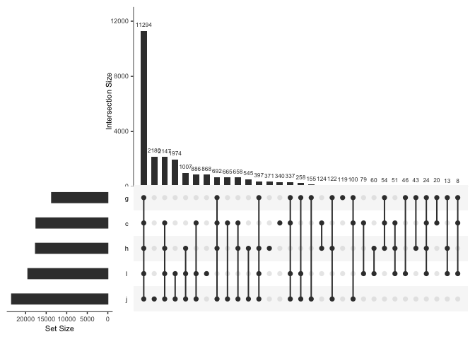

    library(UpSetR)
    library(tidyverse)

    ## ── Attaching packages ─────────────────────────────────────── tidyverse 1.3.2 ──
    ## ✔ ggplot2 3.4.1     ✔ purrr   1.0.1
    ## ✔ tibble  3.1.8     ✔ dplyr   1.1.0
    ## ✔ tidyr   1.3.0     ✔ stringr 1.5.0
    ## ✔ readr   2.1.4     ✔ forcats 1.0.0
    ## ── Conflicts ────────────────────────────────────────── tidyverse_conflicts() ──
    ## ✖ dplyr::filter() masks stats::filter()
    ## ✖ dplyr::lag()    masks stats::lag()

    test2 <- read_csv("../output/upset-test.csv")

    ## Rows: 34947 Columns: 4
    ## ── Column specification ────────────────────────────────────────────────────────
    ## Delimiter: ","
    ## chr (1): gene_id
    ## dbl (3): h, l, g
    ## 
    ## ℹ Use `spec()` to retrieve the full column specification for this data.
    ## ℹ Specify the column types or set `show_col_types = FALSE` to quiet this message.

    head(test2)

    ## # A tibble: 6 × 4
    ##   gene_id             h     l     g
    ##   <chr>           <dbl> <dbl> <dbl>
    ## 1 PGEN_.00g000010     0     1     0
    ## 2 PGEN_.00g000020     0     1     0
    ## 3 PGEN_.00g000030     0     1     0
    ## 4 PGEN_.00g000040     1     1     0
    ## 5 PGEN_.00g000050     1     1     1
    ## 6 PGEN_.00g000060     0     1     0

    str(test2)

    ## spc_tbl_ [34,947 × 4] (S3: spec_tbl_df/tbl_df/tbl/data.frame)
    ##  $ gene_id: chr [1:34947] "PGEN_.00g000010" "PGEN_.00g000020" "PGEN_.00g000030" "PGEN_.00g000040" ...
    ##  $ h      : num [1:34947] 0 0 0 1 1 0 0 1 0 0 ...
    ##  $ l      : num [1:34947] 1 1 1 1 1 1 1 0 0 0 ...
    ##  $ g      : num [1:34947] 0 0 0 0 1 0 0 0 0 0 ...
    ##  - attr(*, "spec")=
    ##   .. cols(
    ##   ..   gene_id = col_character(),
    ##   ..   h = col_double(),
    ##   ..   l = col_double(),
    ##   ..   g = col_double()
    ##   .. )
    ##  - attr(*, "problems")=<externalptr>

## sample data

    movies <- read.csv( system.file("extdata", "movies.csv", package = "UpSetR"), header=T, sep=";" )

    head(movies)

    ##                                 Name ReleaseDate Action Adventure Children
    ## 1                   Toy Story (1995)        1995      0         0        1
    ## 2                     Jumanji (1995)        1995      0         1        1
    ## 3            Grumpier Old Men (1995)        1995      0         0        0
    ## 4           Waiting to Exhale (1995)        1995      0         0        0
    ## 5 Father of the Bride Part II (1995)        1995      0         0        0
    ## 6                        Heat (1995)        1995      1         0        0
    ##   Comedy Crime Documentary Drama Fantasy Noir Horror Musical Mystery Romance
    ## 1      1     0           0     0       0    0      0       0       0       0
    ## 2      0     0           0     0       1    0      0       0       0       0
    ## 3      1     0           0     0       0    0      0       0       0       1
    ## 4      1     0           0     1       0    0      0       0       0       0
    ## 5      1     0           0     0       0    0      0       0       0       0
    ## 6      0     1           0     0       0    0      0       0       0       0
    ##   SciFi Thriller War Western AvgRating Watches
    ## 1     0        0   0       0      4.15    2077
    ## 2     0        0   0       0      3.20     701
    ## 3     0        0   0       0      3.02     478
    ## 4     0        0   0       0      2.73     170
    ## 5     0        0   0       0      3.01     296
    ## 6     0        1   0       0      3.88     940

    str(movies)

    ## 'data.frame':    3883 obs. of  21 variables:
    ##  $ Name       : chr  "Toy Story (1995)" "Jumanji (1995)" "Grumpier Old Men (1995)" "Waiting to Exhale (1995)" ...
    ##  $ ReleaseDate: int  1995 1995 1995 1995 1995 1995 1995 1995 1995 1995 ...
    ##  $ Action     : int  0 0 0 0 0 1 0 0 1 1 ...
    ##  $ Adventure  : int  0 1 0 0 0 0 0 1 0 1 ...
    ##  $ Children   : int  1 1 0 0 0 0 0 1 0 0 ...
    ##  $ Comedy     : int  1 0 1 1 1 0 1 0 0 0 ...
    ##  $ Crime      : int  0 0 0 0 0 1 0 0 0 0 ...
    ##  $ Documentary: int  0 0 0 0 0 0 0 0 0 0 ...
    ##  $ Drama      : int  0 0 0 1 0 0 0 0 0 0 ...
    ##  $ Fantasy    : int  0 1 0 0 0 0 0 0 0 0 ...
    ##  $ Noir       : int  0 0 0 0 0 0 0 0 0 0 ...
    ##  $ Horror     : int  0 0 0 0 0 0 0 0 0 0 ...
    ##  $ Musical    : int  0 0 0 0 0 0 0 0 0 0 ...
    ##  $ Mystery    : int  0 0 0 0 0 0 0 0 0 0 ...
    ##  $ Romance    : int  0 0 1 0 0 0 1 0 0 0 ...
    ##  $ SciFi      : int  0 0 0 0 0 0 0 0 0 0 ...
    ##  $ Thriller   : int  0 0 0 0 0 1 0 0 0 1 ...
    ##  $ War        : int  0 0 0 0 0 0 0 0 0 0 ...
    ##  $ Western    : int  0 0 0 0 0 0 0 0 0 0 ...
    ##  $ AvgRating  : num  4.15 3.2 3.02 2.73 3.01 3.88 3.41 3.01 2.66 3.54 ...
    ##  $ Watches    : int  2077 701 478 170 296 940 458 68 102 888 ...

    upset(movies, sets = c("Action", "Adventure", "Comedy", "Drama", "Mystery", 
        "Thriller", "Romance", "War", "Western"), mb.ratio = c(0.55, 0.45), order.by = "freq")

## my data

Read in data. hemo &lt;-
read.csv(“../project-crab/data/20180522-all-crabs-hemo.csv”,
stringsAsFactors = FALSE) Convert column to numeric
hemo*t**u**b**e**n**u**m**b**e**r* &lt;  − *a**s*.*i**n**t**e**g**e**r*(*h**e**m**o*tube\_number)

Test that as.numeric conversion worked is.numeric(hemo$tube\_number)

    test2 <- read_csv("../output/upset-test.csv",
      show_col_types = should_show_types(),
      skip_empty_rows = TRUE,
       name_repair = "unique",
      na = c("", "NA"),
    col_types = cols(
      gene_id = col_character(),
      h = col_integer(),
      l = col_integer(),
      g = col_integer()
      ))

    test2.df <- as.data.frame(test2)

    str(test2.df)

    ## 'data.frame':    34947 obs. of  4 variables:
    ##  $ gene_id: chr  "PGEN_.00g000010" "PGEN_.00g000020" "PGEN_.00g000030" "PGEN_.00g000040" ...
    ##  $ h      : int  0 0 0 1 1 0 0 1 0 0 ...
    ##  $ l      : int  1 1 1 1 1 1 1 0 0 0 ...
    ##  $ g      : int  0 0 0 0 1 0 0 0 0 0 ...

    head(test2)

    ## # A tibble: 6 × 4
    ##   gene_id             h     l     g
    ##   <chr>           <int> <int> <int>
    ## 1 PGEN_.00g000010     0     1     0
    ## 2 PGEN_.00g000020     0     1     0
    ## 3 PGEN_.00g000030     0     1     0
    ## 4 PGEN_.00g000040     1     1     0
    ## 5 PGEN_.00g000050     1     1     1
    ## 6 PGEN_.00g000060     0     1     0

    upset(test2.df, sets = c("h", "l", "g"))

# Real File

    tissue <- read_delim("../data/salmon.merged.gene_tpm.tsv", col_names = TRUE)

    ## Rows: 34947 Columns: 7
    ## ── Column specification ────────────────────────────────────────────────────────
    ## Delimiter: "\t"
    ## chr (2): gene_id, gene_name
    ## dbl (5): ctenidia, gonad, heart, juvenile, larvae
    ## 
    ## ℹ Use `spec()` to retrieve the full column specification for this data.
    ## ℹ Specify the column types or set `show_col_types = FALSE` to quiet this message.

    top <- read_delim("../data/geoduck_topmarkers_annot.txt", col_names = TRUE)

    ## Rows: 141 Columns: 13
    ## ── Column specification ────────────────────────────────────────────────────────
    ## Delimiter: "\t"
    ## chr (3): gene_id, LOC, gene_ID
    ## dbl (9): cell_group, marker_score, mean_expression, fraction_expressing, spe...
    ## lgl (1): gene_short_name
    ## 
    ## ℹ Use `spec()` to retrieve the full column specification for this data.
    ## ℹ Specify the column types or set `show_col_types = FALSE` to quiet this message.

    topwide <- top %>% 
    select(gene_id, cell_group, specificity) %>%
    pivot_wider(names_from = cell_group, values_from = specificity)

    exp <- left_join(tissue, topwide)

    ## Joining with `by = join_by(gene_id)`

    str(exp)

    ## spc_tbl_ [34,947 × 22] (S3: spec_tbl_df/tbl_df/tbl/data.frame)
    ##  $ gene_id  : chr [1:34947] "PGEN_.00g000010" "PGEN_.00g000020" "PGEN_.00g000030" "PGEN_.00g000040" ...
    ##  $ gene_name: chr [1:34947] "PGEN_.00g000010" "PGEN_.00g000020" "PGEN_.00g000030" "PGEN_.00g000040" ...
    ##  $ ctenidia : num [1:34947] 0 0 0.225 0.566 0.508 ...
    ##  $ gonad    : num [1:34947] 0 0 0 0 4.75 ...
    ##  $ heart    : num [1:34947] 0 0 0 0.255 0.228 ...
    ##  $ juvenile : num [1:34947] 4.8519 0.8402 0.0696 0.3764 0.1827 ...
    ##  $ larvae   : num [1:34947] 3.4237 0.3703 0.0525 1.1311 1.1177 ...
    ##  $ 1        : num [1:34947] NA NA NA NA NA NA NA NA NA NA ...
    ##  $ 2        : num [1:34947] NA NA NA NA NA NA NA NA NA NA ...
    ##  $ 3        : num [1:34947] NA NA NA NA NA NA NA NA NA NA ...
    ##  $ 4        : num [1:34947] NA NA NA NA NA NA NA NA NA NA ...
    ##  $ 5        : num [1:34947] NA NA NA NA NA NA NA NA NA NA ...
    ##  $ 6        : num [1:34947] NA NA NA NA NA NA NA NA NA NA ...
    ##  $ 7        : num [1:34947] NA NA NA NA NA NA NA NA NA NA ...
    ##  $ 8        : num [1:34947] NA NA NA NA NA NA NA NA NA NA ...
    ##  $ 9        : num [1:34947] NA NA NA NA NA NA NA NA NA NA ...
    ##  $ 10       : num [1:34947] NA NA NA NA NA NA NA NA NA NA ...
    ##  $ 11       : num [1:34947] NA NA NA NA NA NA NA NA NA NA ...
    ##  $ 12       : num [1:34947] NA NA NA NA NA NA NA NA NA NA ...
    ##  $ 13       : num [1:34947] NA NA NA NA NA NA NA NA NA NA ...
    ##  $ 14       : num [1:34947] NA NA NA NA NA NA NA NA NA NA ...
    ##  $ NA       : num [1:34947] NA NA NA NA NA NA NA NA NA NA ...
    ##  - attr(*, "spec")=
    ##   .. cols(
    ##   ..   gene_id = col_character(),
    ##   ..   gene_name = col_character(),
    ##   ..   ctenidia = col_double(),
    ##   ..   gonad = col_double(),
    ##   ..   heart = col_double(),
    ##   ..   juvenile = col_double(),
    ##   ..   larvae = col_double()
    ##   .. )
    ##  - attr(*, "problems")=<externalptr>

    exp.df <- as.data.frame(exp)

    str(exp.df)

    ## 'data.frame':    34947 obs. of  22 variables:
    ##  $ gene_id  : chr  "PGEN_.00g000010" "PGEN_.00g000020" "PGEN_.00g000030" "PGEN_.00g000040" ...
    ##  $ gene_name: chr  "PGEN_.00g000010" "PGEN_.00g000020" "PGEN_.00g000030" "PGEN_.00g000040" ...
    ##  $ ctenidia : num  0 0 0.225 0.566 0.508 ...
    ##  $ gonad    : num  0 0 0 0 4.75 ...
    ##  $ heart    : num  0 0 0 0.255 0.228 ...
    ##  $ juvenile : num  4.8519 0.8402 0.0696 0.3764 0.1827 ...
    ##  $ larvae   : num  3.4237 0.3703 0.0525 1.1311 1.1177 ...
    ##  $ 1        : num  NA NA NA NA NA NA NA NA NA NA ...
    ##  $ 2        : num  NA NA NA NA NA NA NA NA NA NA ...
    ##  $ 3        : num  NA NA NA NA NA NA NA NA NA NA ...
    ##  $ 4        : num  NA NA NA NA NA NA NA NA NA NA ...
    ##  $ 5        : num  NA NA NA NA NA NA NA NA NA NA ...
    ##  $ 6        : num  NA NA NA NA NA NA NA NA NA NA ...
    ##  $ 7        : num  NA NA NA NA NA NA NA NA NA NA ...
    ##  $ 8        : num  NA NA NA NA NA NA NA NA NA NA ...
    ##  $ 9        : num  NA NA NA NA NA NA NA NA NA NA ...
    ##  $ 10       : num  NA NA NA NA NA NA NA NA NA NA ...
    ##  $ 11       : num  NA NA NA NA NA NA NA NA NA NA ...
    ##  $ 12       : num  NA NA NA NA NA NA NA NA NA NA ...
    ##  $ 13       : num  NA NA NA NA NA NA NA NA NA NA ...
    ##  $ 14       : num  NA NA NA NA NA NA NA NA NA NA ...
    ##  $ NA       : num  NA NA NA NA NA NA NA NA NA NA ...

    exp2 <- as.data.frame(
      exp %>% mutate(h= ifelse(heart > 0, 1, ifelse(heart == 0, 0, NA))) %>%
      mutate(l = ifelse(larvae > 0, 1, ifelse(larvae == 0, 0, NA))) %>%
      mutate(g= ifelse(gonad > 0, 1, ifelse(gonad == 0, 0, NA))) %>%
      mutate(c= ifelse(ctenidia > 0, 1, ifelse(ctenidia == 0, 0, NA))) %>%
      mutate(j= ifelse(juvenile > 0, 1, ifelse(juvenile == 0, 0, NA))) %>%
      mutate_at(c('h', 'l', 'g', 'c', 'j'), as.numeric)  %>%
      select(gene_id,h,l,g,c,j)
    )

    str(exp2)

    ## 'data.frame':    34947 obs. of  6 variables:
    ##  $ gene_id: chr  "PGEN_.00g000010" "PGEN_.00g000020" "PGEN_.00g000030" "PGEN_.00g000040" ...
    ##  $ h      : num  0 0 0 1 1 0 0 1 0 0 ...
    ##  $ l      : num  1 1 1 1 1 1 1 0 0 0 ...
    ##  $ g      : num  0 0 0 0 1 0 0 0 0 0 ...
    ##  $ c      : num  0 0 1 1 1 1 0 0 1 0 ...
    ##  $ j      : num  1 1 1 1 1 1 1 1 1 1 ...

    upset(exp2)

    upset(exp2, sets.bar.color = "#56B4E9",
    order.by = "freq", empty.intersections = "on")

    upset(exp2, mb.ratio = c(0.55, 0.45), order.by = "freq")

    upset(exp2, nintersects = 70, group.by = "sets", cutoff = 7)

